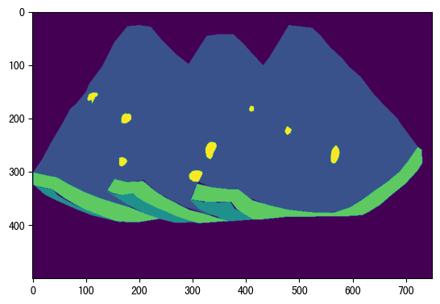
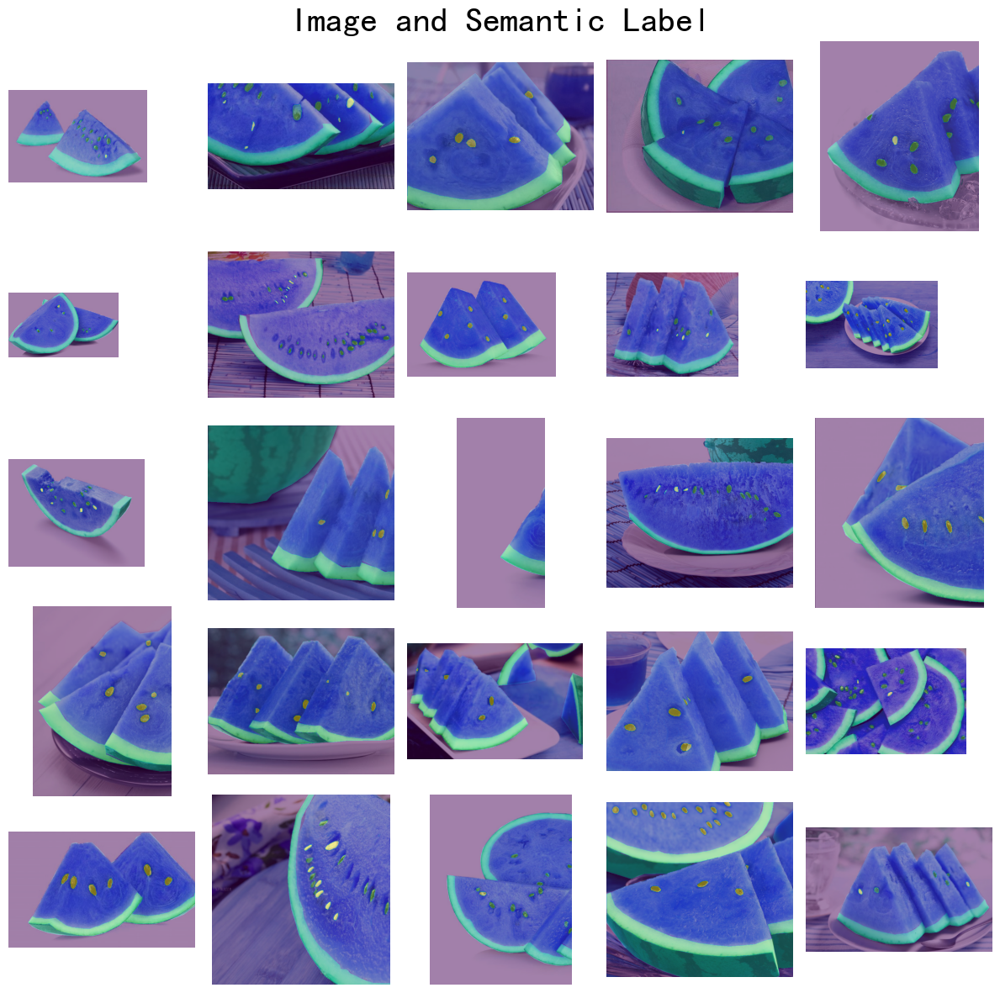

# MMSegmentation代码实战作业

张子豪 2023-2-8 6-11

## 使用MMSegmentation，在自己的数据集上，训练语义分割模型。

- 数据集标注（可选）

使用Labelme、LabelU等数据标注工具，标注多类别语义分割数据集，并转换为Mask灰度图格式。

- 数据集整理

划分训练集、测试集

- 使用MMSegmentation训练语义分割模型

在MMSegmentation中，指定预训练模型，配置config文件，修改类别数、学习率。

- 用训练得到的模型预测

获得测试集图片或新图片的语义分割预测结果，对结果进行可视化和后处理。

- 在测试集上评估算法的速度和精度性能

- 使用MMDeploy部署语义分割模型（可选）

## 推荐使用数据集

- 单类别

组织病理切片小鼠肾小球：https://zihao-openmmlab.obs.cn-east-3.myhuaweicloud.com/20230130-mmseg/dataset/Glomeruli-dataset.zip

- 多类别

迪拜卫星航拍六类别：https://www.kaggle.com/datasets/humansintheloop/semantic-segmentation-of-aerial-imagery

## 其它单类别语义分割数据集

乳腺癌：https://www.kaggle.com/datasets/aryashah2k/breast-ultrasound-images-dataset

电子显微镜粒子：https://www.kaggle.com/datasets/batuhanyil/electron-microscopy-particle-segmentation

农作物病虫害叶片：https://www.kaggle.com/datasets/fakhrealam9537/leaf-disease-segmentation-dataset

农作物地块：https://www.kaggle.com/datasets/khlaifiabilel/pastis

洪水航拍区域：https://www.kaggle.com/datasets/faizalkarim/flood-area-segmentation?select=Image

指甲：https://www.kaggle.com/datasets/vpapenko/nails-segmentation

水下场景：https://www.kaggle.com/datasets/ashish2001/semantic-segmentation-of-underwater-imagery-suim

西红柿种子：https://www.kaggle.com/datasets/juanma9901/tomatoseedsdatasetjm

肾小球：https://www.kaggle.com/datasets/baesiann/glomeruli-hubmap-external-1024x1024

卫星建筑物：https://www.kaggle.com/datasets/hyyyrwang/buildings-dataset

荧光显微镜小鼠脑切片发光神经元-实例分割：https://www.kaggle.com/datasets/nbroad/fluorescent-neuronal-cells

混凝土裂缝：https://www.kaggle.com/datasets/jakubniemiec/concrete-crack-images

核磁共振脑瘤分割：https://www.kaggle.com/datasets/awsaf49/brats2020-training-data

腹部CT肝脏病变分割：https://www.kaggle.com/datasets/andrewmvd/liver-tumor-segmentation

脑部神经胶质瘤核磁共振：https://www.kaggle.com/datasets/mateuszbuda/lgg-mri-segmentation

## 其它多类别语义分割数据集

高分辨率航拍-多类别：https://www.kaggle.com/datasets/titan15555/uavid-semantic-segmentation-dataset

无人机航拍：https://www.kaggle.com/datasets/bulentsiyah/semantic-drone-dataset

衣物：https://www.kaggle.com/datasets/rajkumarl/people-clothing-segmentation

海洋生物：https://www.kaggle.com/datasets/crowww/a-large-scale-fish-dataset

腿和脚趾：https://www.kaggle.com/datasets/tapakah68/legs-segmentation

无人机航拍：https://www.kaggle.com/datasets/santurini/semantic-segmentation-drone-dataset

## 其它图像分类数据集

气胸：https://www.kaggle.com/c/siim-acr-pneumothorax-segmentation


```python
!pwd
```

    /home/pengzhihui/WorkSpace/playground


```python
import os
os.chdir('mmsegmentation')
```


```python

os.getcwd()
```


    '/home/pengzhihui/WorkSpace/playground/mmsegmentation'


```python
# 下载数据集压缩包
!wget https://zihao-openmmlab.obs.cn-east-3.myhuaweicloud.com/20230130-mmseg/dataset/watermelon/Watermelon87_Semantic_Seg_Mask.zip

```

    --2023-06-15 14:39:11--  https://zihao-openmmlab.obs.cn-east-3.myhuaweicloud.com/20230130-mmseg/dataset/watermelon/Watermelon87_Semantic_Seg_Mask.zip
    Resolving zihao-openmmlab.obs.cn-east-3.myhuaweicloud.com (zihao-openmmlab.obs.cn-east-3.myhuaweicloud.com)... 121.36.235.132
    Connecting to zihao-openmmlab.obs.cn-east-3.myhuaweicloud.com (zihao-openmmlab.obs.cn-east-3.myhuaweicloud.com)|121.36.235.132|:443... connected.
    HTTP request sent, awaiting response... 200 OK
    Length: 13230222 (13M) [application/zip]
    Saving to: ‘Watermelon87_Semantic_Seg_Mask.zip’
    
    Watermelon87_Semant 100%[===================>]  12.62M  5.70MB/s    in 2.2s    
    
    2023-06-15 14:39:14 (5.70 MB/s) - ‘Watermelon87_Semantic_Seg_Mask.zip’ saved [13230222/13230222]
    


```python
# 解压
!unzip Watermelon87_Semantic_Seg_Mask.zip
```

    Archive:  Watermelon87_Semantic_Seg_Mask.zip
       creating: Watermelon87_Semantic_Seg_Mask/
       creating: Watermelon87_Semantic_Seg_Mask/img_dir/
       creating: Watermelon87_Semantic_Seg_Mask/img_dir/train/
      inflating: Watermelon87_Semantic_Seg_Mask/img_dir/train/IMG_6865-1024x683.jpg  
      inflating: Watermelon87_Semantic_Seg_Mask/img_dir/train/unnamed.jpg  
      inflating: Watermelon87_Semantic_Seg_Mask/img_dir/train/maxresdefault.jpg  
      inflating: Watermelon87_Semantic_Seg_Mask/img_dir/train/R (2).jpeg  
      inflating: Watermelon87_Semantic_Seg_Mask/img_dir/train/R (1).jpeg  
      inflating: Watermelon87_Semantic_Seg_Mask/img_dir/train/20170613134012_430390.jpg  
      inflating: Watermelon87_Semantic_Seg_Mask/img_dir/train/OIP (5).jpeg  
      inflating: Watermelon87_Semantic_Seg_Mask/img_dir/train/04_35-2.jpg  
      inflating: Watermelon87_Semantic_Seg_Mask/img_dir/train/pureform-citrulline.jpg  
      inflating: Watermelon87_Semantic_Seg_Mask/img_dir/train/24a3a0f8a11ae29f8ccca35c822ac0e2991b4773.png  
      inflating: Watermelon87_Semantic_Seg_Mask/img_dir/train/test.jpg  
      inflating: Watermelon87_Semantic_Seg_Mask/img_dir/train/Watermelon.jpg  
      inflating: Watermelon87_Semantic_Seg_Mask/img_dir/train/OIP (15).jpeg  
      inflating: Watermelon87_Semantic_Seg_Mask/img_dir/train/R (3).jpeg  
      inflating: Watermelon87_Semantic_Seg_Mask/img_dir/train/OIP (3).jpeg  
      inflating: Watermelon87_Semantic_Seg_Mask/img_dir/train/vDMIiCPqS1EC.jpg  
      inflating: Watermelon87_Semantic_Seg_Mask/img_dir/train/R (9).jpeg  
      inflating: Watermelon87_Semantic_Seg_Mask/img_dir/train/s0569_001_c01.jpg  
      inflating: Watermelon87_Semantic_Seg_Mask/img_dir/train/OIP (10).jpeg  
      inflating: Watermelon87_Semantic_Seg_Mask/img_dir/train/OIP (1).jpeg  
      inflating: Watermelon87_Semantic_Seg_Mask/img_dir/train/2401-food-tip-image-MAIN.jpg  
      inflating: Watermelon87_Semantic_Seg_Mask/img_dir/train/OIP (2).jpeg  
      inflating: Watermelon87_Semantic_Seg_Mask/img_dir/train/69735779_m-5b756b48997fa.jpg  
      inflating: Watermelon87_Semantic_Seg_Mask/img_dir/train/360_F_85084369_iab0VH1ohx2lHtM3OfCncfE9I7VPpl0N.jpg  
      inflating: Watermelon87_Semantic_Seg_Mask/img_dir/train/045_sozai_l.jpg  
      inflating: Watermelon87_Semantic_Seg_Mask/img_dir/train/skmrk03.jpg  
      inflating: Watermelon87_Semantic_Seg_Mask/img_dir/train/8fe7f149146b6866.jpg  
      inflating: Watermelon87_Semantic_Seg_Mask/img_dir/train/uportcocoloni_16696_0.jpg  
      inflating: Watermelon87_Semantic_Seg_Mask/img_dir/train/OIP (8).jpeg  
      inflating: Watermelon87_Semantic_Seg_Mask/img_dir/train/alkompis_QGYeyHjwPY-scaled.jpg  
      inflating: Watermelon87_Semantic_Seg_Mask/img_dir/train/OIP (7).jpeg  
      inflating: Watermelon87_Semantic_Seg_Mask/img_dir/train/ac330c7605098e36de5507d857d0b55c.jpg  
      inflating: Watermelon87_Semantic_Seg_Mask/img_dir/train/c38e1f595c46d502c75bda7ec9bf6078.jpg  
      inflating: Watermelon87_Semantic_Seg_Mask/img_dir/train/68200_main-1.jpg  
      inflating: Watermelon87_Semantic_Seg_Mask/img_dir/train/OIP (12).jpeg  
      inflating: Watermelon87_Semantic_Seg_Mask/img_dir/train/ed2de27518d0526380c9bcc9f9fb78333565cce8.jpg  
      inflating: Watermelon87_Semantic_Seg_Mask/img_dir/train/R (8).jpeg  
      inflating: Watermelon87_Semantic_Seg_Mask/img_dir/train/11-loai-trai-cay-dinh-duong-nen-an-hang-ngay-dua-hau.jpg  
      inflating: Watermelon87_Semantic_Seg_Mask/img_dir/train/piece-watermelon-isolated-white-background-top-view-95945299.jpg  
      inflating: Watermelon87_Semantic_Seg_Mask/img_dir/train/suika011.jpg  
      inflating: Watermelon87_Semantic_Seg_Mask/img_dir/train/R (5).jpeg  
      inflating: Watermelon87_Semantic_Seg_Mask/img_dir/train/R (10).jpeg  
      inflating: Watermelon87_Semantic_Seg_Mask/img_dir/train/OIP.jpeg  
      inflating: Watermelon87_Semantic_Seg_Mask/img_dir/train/istockphoto-849574338-170667a.jpg  
      inflating: Watermelon87_Semantic_Seg_Mask/img_dir/train/R (14).jpeg  
      inflating: Watermelon87_Semantic_Seg_Mask/img_dir/train/31cc9b997d1e3a8ed5b6a3cbf5efd86d.jpg  
      inflating: Watermelon87_Semantic_Seg_Mask/img_dir/train/da23-e4580.jpg  
      inflating: Watermelon87_Semantic_Seg_Mask/img_dir/train/468D11D9CB53158C55CF126CFE3D49C0A070758A_size321_w400_h400.png  
      inflating: Watermelon87_Semantic_Seg_Mask/img_dir/train/img_de56fb30d23e2c761302ba61198a4be4233656.jpg  
      inflating: Watermelon87_Semantic_Seg_Mask/img_dir/train/R (15).jpeg  
      inflating: Watermelon87_Semantic_Seg_Mask/img_dir/train/1471253631_2.jpg  
      inflating: Watermelon87_Semantic_Seg_Mask/img_dir/train/Manfaat-buah-semangka.jpg  
      inflating: Watermelon87_Semantic_Seg_Mask/img_dir/train/adpDSC_5275-750x499.jpg  
      inflating: Watermelon87_Semantic_Seg_Mask/img_dir/train/shutterstock_457769608.jpg  
      inflating: Watermelon87_Semantic_Seg_Mask/img_dir/train/o0833068314488481500.jpg  
      inflating: Watermelon87_Semantic_Seg_Mask/img_dir/train/thum-20180809094803.jpg  
      inflating: Watermelon87_Semantic_Seg_Mask/img_dir/train/7c75f4c6f3bdd9d61d8782ddff1ff6ac.jpg  
      inflating: Watermelon87_Semantic_Seg_Mask/img_dir/train/img4f375505zik9zj.jpeg  
      inflating: Watermelon87_Semantic_Seg_Mask/img_dir/train/202007220195_top_img_A.jpg  
      inflating: Watermelon87_Semantic_Seg_Mask/img_dir/train/R (13).jpeg  
      inflating: Watermelon87_Semantic_Seg_Mask/img_dir/train/1510702494080_melon_NWS_block-low.jpg  
      inflating: Watermelon87_Semantic_Seg_Mask/img_dir/train/pfauwbexemva1nvwobqs.jpg  
      inflating: Watermelon87_Semantic_Seg_Mask/img_dir/train/img56610866.jpg  
      inflating: Watermelon87_Semantic_Seg_Mask/img_dir/train/0778_02.jpg  
      inflating: Watermelon87_Semantic_Seg_Mask/img_dir/train/21746.1.jpg  
      inflating: Watermelon87_Semantic_Seg_Mask/img_dir/train/8-thuc-pham-chong-cam-cum-1459496975020.jpg  
      inflating: Watermelon87_Semantic_Seg_Mask/img_dir/train/huyet-ap-cao-thap-nen-an-gi-kieng-gi-tot-on-dinh-2.jpg  
      inflating: Watermelon87_Semantic_Seg_Mask/img_dir/train/foods083_img01.jpg  
      inflating: Watermelon87_Semantic_Seg_Mask/img_dir/train/OIP (14).jpeg  
      inflating: Watermelon87_Semantic_Seg_Mask/img_dir/train/watermelon-slices.jpg  
       creating: Watermelon87_Semantic_Seg_Mask/img_dir/val/
      inflating: Watermelon87_Semantic_Seg_Mask/img_dir/val/watermelon-medium.jpg  
      inflating: Watermelon87_Semantic_Seg_Mask/img_dir/val/la_wm_img01.jpg  
      inflating: Watermelon87_Semantic_Seg_Mask/img_dir/val/OIP (11).jpeg  
      inflating: Watermelon87_Semantic_Seg_Mask/img_dir/val/01bd15599c606aa801201794e1fa30.jpg@1280w_1l_2o_100sh.jpg  
      inflating: Watermelon87_Semantic_Seg_Mask/img_dir/val/17897490_93d9666602_z.jpg  
      inflating: Watermelon87_Semantic_Seg_Mask/img_dir/val/R.jpeg  
      inflating: Watermelon87_Semantic_Seg_Mask/img_dir/val/5b3c8018N634d43bd.jpg  
      inflating: Watermelon87_Semantic_Seg_Mask/img_dir/val/dua-hau-1.jpg  
      inflating: Watermelon87_Semantic_Seg_Mask/img_dir/val/depositphotos_204189678-stock-photo-slice-watermelon-white-background.jpg  
      inflating: Watermelon87_Semantic_Seg_Mask/img_dir/val/OIP (13).jpeg  
      inflating: Watermelon87_Semantic_Seg_Mask/img_dir/val/e52m_8686.jpg  
      inflating: Watermelon87_Semantic_Seg_Mask/img_dir/val/OIP (9).jpeg  
      inflating: Watermelon87_Semantic_Seg_Mask/img_dir/val/OIP (4).jpeg  
      inflating: Watermelon87_Semantic_Seg_Mask/img_dir/val/R (4).jpeg  
      inflating: Watermelon87_Semantic_Seg_Mask/img_dir/val/L007-05_5.jpg  
      inflating: Watermelon87_Semantic_Seg_Mask/img_dir/val/dun-soi-hat-dua-hau-lay-nuoc-uong-ban-se-bat-ngo-vi-ket-qua-nuochatduah--u1-1493799084-width500height313.jpg  
      inflating: Watermelon87_Semantic_Seg_Mask/img_dir/val/denn-ke-11-7.jpg  
       creating: Watermelon87_Semantic_Seg_Mask/ann_dir/
       creating: Watermelon87_Semantic_Seg_Mask/ann_dir/train/
      inflating: Watermelon87_Semantic_Seg_Mask/ann_dir/train/IMG_6865-1024x683.png  
      inflating: Watermelon87_Semantic_Seg_Mask/ann_dir/train/unnamed.png  
      inflating: Watermelon87_Semantic_Seg_Mask/ann_dir/train/maxresdefault.png  
      inflating: Watermelon87_Semantic_Seg_Mask/ann_dir/train/R (2).png  
      inflating: Watermelon87_Semantic_Seg_Mask/ann_dir/train/R (1).png  
      inflating: Watermelon87_Semantic_Seg_Mask/ann_dir/train/20170613134012_430390.png  
      inflating: Watermelon87_Semantic_Seg_Mask/ann_dir/train/OIP (5).png  
      inflating: Watermelon87_Semantic_Seg_Mask/ann_dir/train/04_35-2.png  
      inflating: Watermelon87_Semantic_Seg_Mask/ann_dir/train/pureform-citrulline.png  
      inflating: Watermelon87_Semantic_Seg_Mask/ann_dir/train/24a3a0f8a11ae29f8ccca35c822ac0e2991b4773.png  
      inflating: Watermelon87_Semantic_Seg_Mask/ann_dir/train/test.png  
      inflating: Watermelon87_Semantic_Seg_Mask/ann_dir/train/Watermelon.png  
      inflating: Watermelon87_Semantic_Seg_Mask/ann_dir/train/OIP (15).png  
      inflating: Watermelon87_Semantic_Seg_Mask/ann_dir/train/R (3).png  
      inflating: Watermelon87_Semantic_Seg_Mask/ann_dir/train/OIP (3).png  
      inflating: Watermelon87_Semantic_Seg_Mask/ann_dir/train/vDMIiCPqS1EC.png  
      inflating: Watermelon87_Semantic_Seg_Mask/ann_dir/train/R (9).png  
      inflating: Watermelon87_Semantic_Seg_Mask/ann_dir/train/s0569_001_c01.png  
      inflating: Watermelon87_Semantic_Seg_Mask/ann_dir/train/OIP (10).png  
      inflating: Watermelon87_Semantic_Seg_Mask/ann_dir/train/OIP (1).png  
      inflating: Watermelon87_Semantic_Seg_Mask/ann_dir/train/2401-food-tip-image-MAIN.png  
      inflating: Watermelon87_Semantic_Seg_Mask/ann_dir/train/OIP (2).png  
      inflating: Watermelon87_Semantic_Seg_Mask/ann_dir/train/69735779_m-5b756b48997fa.png  
      inflating: Watermelon87_Semantic_Seg_Mask/ann_dir/train/360_F_85084369_iab0VH1ohx2lHtM3OfCncfE9I7VPpl0N.png  
      inflating: Watermelon87_Semantic_Seg_Mask/ann_dir/train/045_sozai_l.png  
      inflating: Watermelon87_Semantic_Seg_Mask/ann_dir/train/skmrk03.png  
      inflating: Watermelon87_Semantic_Seg_Mask/ann_dir/train/8fe7f149146b6866.png  
      inflating: Watermelon87_Semantic_Seg_Mask/ann_dir/train/uportcocoloni_16696_0.png  
      inflating: Watermelon87_Semantic_Seg_Mask/ann_dir/train/OIP (8).png  
      inflating: Watermelon87_Semantic_Seg_Mask/ann_dir/train/alkompis_QGYeyHjwPY-scaled.png  
      inflating: Watermelon87_Semantic_Seg_Mask/ann_dir/train/OIP (7).png  
      inflating: Watermelon87_Semantic_Seg_Mask/ann_dir/train/ac330c7605098e36de5507d857d0b55c.png  
      inflating: Watermelon87_Semantic_Seg_Mask/ann_dir/train/c38e1f595c46d502c75bda7ec9bf6078.png  
      inflating: Watermelon87_Semantic_Seg_Mask/ann_dir/train/68200_main-1.png  
      inflating: Watermelon87_Semantic_Seg_Mask/ann_dir/train/OIP (12).png  
      inflating: Watermelon87_Semantic_Seg_Mask/ann_dir/train/ed2de27518d0526380c9bcc9f9fb78333565cce8.png  
      inflating: Watermelon87_Semantic_Seg_Mask/ann_dir/train/R (8).png  
      inflating: Watermelon87_Semantic_Seg_Mask/ann_dir/train/11-loai-trai-cay-dinh-duong-nen-an-hang-ngay-dua-hau.png  
      inflating: Watermelon87_Semantic_Seg_Mask/ann_dir/train/piece-watermelon-isolated-white-background-top-view-95945299.png  
      inflating: Watermelon87_Semantic_Seg_Mask/ann_dir/train/suika011.png  
      inflating: Watermelon87_Semantic_Seg_Mask/ann_dir/train/R (5).png  
      inflating: Watermelon87_Semantic_Seg_Mask/ann_dir/train/R (10).png  
      inflating: Watermelon87_Semantic_Seg_Mask/ann_dir/train/OIP.png  
      inflating: Watermelon87_Semantic_Seg_Mask/ann_dir/train/istockphoto-849574338-170667a.png  
      inflating: Watermelon87_Semantic_Seg_Mask/ann_dir/train/R (14).png  
      inflating: Watermelon87_Semantic_Seg_Mask/ann_dir/train/31cc9b997d1e3a8ed5b6a3cbf5efd86d.png  
      inflating: Watermelon87_Semantic_Seg_Mask/ann_dir/train/da23-e4580.png  
      inflating: Watermelon87_Semantic_Seg_Mask/ann_dir/train/468D11D9CB53158C55CF126CFE3D49C0A070758A_size321_w400_h400.png  
      inflating: Watermelon87_Semantic_Seg_Mask/ann_dir/train/img_de56fb30d23e2c761302ba61198a4be4233656.png  
      inflating: Watermelon87_Semantic_Seg_Mask/ann_dir/train/R (15).png  
      inflating: Watermelon87_Semantic_Seg_Mask/ann_dir/train/1471253631_2.png  
      inflating: Watermelon87_Semantic_Seg_Mask/ann_dir/train/Manfaat-buah-semangka.png  
      inflating: Watermelon87_Semantic_Seg_Mask/ann_dir/train/adpDSC_5275-750x499.png  
      inflating: Watermelon87_Semantic_Seg_Mask/ann_dir/train/shutterstock_457769608.png  
      inflating: Watermelon87_Semantic_Seg_Mask/ann_dir/train/o0833068314488481500.png  
      inflating: Watermelon87_Semantic_Seg_Mask/ann_dir/train/thum-20180809094803.png  
      inflating: Watermelon87_Semantic_Seg_Mask/ann_dir/train/7c75f4c6f3bdd9d61d8782ddff1ff6ac.png  
      inflating: Watermelon87_Semantic_Seg_Mask/ann_dir/train/img4f375505zik9zj.png  
      inflating: Watermelon87_Semantic_Seg_Mask/ann_dir/train/202007220195_top_img_A.png  
      inflating: Watermelon87_Semantic_Seg_Mask/ann_dir/train/R (13).png  
      inflating: Watermelon87_Semantic_Seg_Mask/ann_dir/train/1510702494080_melon_NWS_block-low.png  
      inflating: Watermelon87_Semantic_Seg_Mask/ann_dir/train/pfauwbexemva1nvwobqs.png  
      inflating: Watermelon87_Semantic_Seg_Mask/ann_dir/train/img56610866.png  
      inflating: Watermelon87_Semantic_Seg_Mask/ann_dir/train/0778_02.png  
      inflating: Watermelon87_Semantic_Seg_Mask/ann_dir/train/21746.png  
      inflating: Watermelon87_Semantic_Seg_Mask/ann_dir/train/8-thuc-pham-chong-cam-cum-1459496975020.png  
      inflating: Watermelon87_Semantic_Seg_Mask/ann_dir/train/huyet-ap-cao-thap-nen-an-gi-kieng-gi-tot-on-dinh-2.png  
      inflating: Watermelon87_Semantic_Seg_Mask/ann_dir/train/foods083_img01.png  
      inflating: Watermelon87_Semantic_Seg_Mask/ann_dir/train/OIP (14).png  
      inflating: Watermelon87_Semantic_Seg_Mask/ann_dir/train/watermelon-slices.png  
       creating: Watermelon87_Semantic_Seg_Mask/ann_dir/val/
      inflating: Watermelon87_Semantic_Seg_Mask/ann_dir/val/watermelon-medium.png  
      inflating: Watermelon87_Semantic_Seg_Mask/ann_dir/val/la_wm_img01.png  
      inflating: Watermelon87_Semantic_Seg_Mask/ann_dir/val/OIP (11).png  
      inflating: Watermelon87_Semantic_Seg_Mask/ann_dir/val/01bd15599c606aa801201794e1fa30.png  
      inflating: Watermelon87_Semantic_Seg_Mask/ann_dir/val/17897490_93d9666602_z.png  
      inflating: Watermelon87_Semantic_Seg_Mask/ann_dir/val/R.png  
      inflating: Watermelon87_Semantic_Seg_Mask/ann_dir/val/5b3c8018N634d43bd.png  
      inflating: Watermelon87_Semantic_Seg_Mask/ann_dir/val/dua-hau-1.png  
      inflating: Watermelon87_Semantic_Seg_Mask/ann_dir/val/depositphotos_204189678-stock-photo-slice-watermelon-white-background.png  
      inflating: Watermelon87_Semantic_Seg_Mask/ann_dir/val/OIP (13).png  
      inflating: Watermelon87_Semantic_Seg_Mask/ann_dir/val/e52m_8686.png  
      inflating: Watermelon87_Semantic_Seg_Mask/ann_dir/val/OIP (9).png  
      inflating: Watermelon87_Semantic_Seg_Mask/ann_dir/val/OIP (4).png  
      inflating: Watermelon87_Semantic_Seg_Mask/ann_dir/val/R (4).png  
      inflating: Watermelon87_Semantic_Seg_Mask/ann_dir/val/L007-05_5.png  
      inflating: Watermelon87_Semantic_Seg_Mask/ann_dir/val/dun-soi-hat-dua-hau-lay-nuoc-uong-ban-se-bat-ngo-vi-ket-qua-nuochatduah--u1-1493799084-width500height313.png  
      inflating: Watermelon87_Semantic_Seg_Mask/ann_dir/val/denn-ke-11-7.png  


```python

```


```python

```


```python
import os

import cv2
import numpy as np
from PIL import Image
from tqdm import tqdm

import matplotlib.pyplot as plt
%matplotlib inline
```


```python
# 指定单张图像路径
img_path = 'Watermelon87_Semantic_Seg_Mask/img_dir/train/20170613134012_430390.jpg'
mask_path = 'Watermelon87_Semantic_Seg_Mask/ann_dir/train/20170613134012_430390.png'
```


```python
Image.open(img_path)
```


    

    


```python
Image.open(mask_path)
```


    

    


```python

img = cv2.imread(img_path)
mask = cv2.imread(mask_path)
```


```python
img.shape

```


    (500, 750, 3)


```python
mask.shape
```


    (500, 750, 3)


```python
# mask 语义分割标注，与原图大小相同
np.unique(mask)
```


    array([0, 1, 2, 3, 4], dtype=uint8)


```python
# 可视化语义分割标注
plt.imshow(mask[:,:,0])
plt.show()
```


    

    


```python
plt.imshow(img[:,:,::-1])
plt.imshow(mask[:,:,0], alpha=0.4) # alpha 高亮区域透明度，越小越接近原图
plt.axis('off')
plt.show()
```


    

    


```python
# 指定图像和标注路径
PATH_IMAGE = 'Watermelon87_Semantic_Seg_Mask//img_dir/train'
PATH_MASKS = 'Watermelon87_Semantic_Seg_Mask//ann_dir/train'
```


```python
# n行n列可视化
n = 5

# 标注区域透明度
opacity = 0.5

fig, axes = plt.subplots(nrows=n, ncols=n, sharex=True, figsize=(12,12))

for i, file_name in enumerate(os.listdir(PATH_IMAGE)[:n**2]):
    
    # 载入图像和标注
    img_path = os.path.join(PATH_IMAGE, file_name)
    mask_path = os.path.join(PATH_MASKS, file_name.split('.')[0]+'.png')
    img = cv2.imread(img_path)
    mask = cv2.imread(mask_path)
    
    # 可视化
    axes[i//n, i%n].imshow(img)
    axes[i//n, i%n].imshow(mask[:,:,0], alpha=opacity)
    axes[i//n, i%n].axis('off') # 关闭坐标轴显示
fig.suptitle('Image and Semantic Label', fontsize=30)
plt.tight_layout()
plt.show()
```


    

    


```python

```


```python

```


```python

```


```python

```


```python

```


```python
import numpy as np
from PIL import Image

import os.path as osp
from tqdm import tqdm

import mmcv
import mmengine
import matplotlib.pyplot as plt
%matplotlib inline
```


```python
os.getcwd()
```


    '/home/pengzhihui/WorkSpace/playground/mmsegmentation'


```python
!rm -rf mmseg/datasets/DubaiDataset.py # 删除原有文件
!wget https://zihao-openmmlab.obs.cn-east-3.myhuaweicloud.com/20230130-mmseg/Dubai/DubaiDataset.py -P mmseg/datasets
```

    --2023-06-15 14:56:07--  https://zihao-openmmlab.obs.cn-east-3.myhuaweicloud.com/20230130-mmseg/Dubai/DubaiDataset.py
    Resolving zihao-openmmlab.obs.cn-east-3.myhuaweicloud.com (zihao-openmmlab.obs.cn-east-3.myhuaweicloud.com)... 121.36.235.132
    Connecting to zihao-openmmlab.obs.cn-east-3.myhuaweicloud.com (zihao-openmmlab.obs.cn-east-3.myhuaweicloud.com)|121.36.235.132|:443... connected.
    HTTP request sent, awaiting response... 200 OK
    Length: 867 [binary/octet-stream]
    Saving to: ‘mmseg/datasets/DubaiDataset.py’
    
    DubaiDataset.py     100%[===================>]     867  --.-KB/s    in 0s      
    
    2023-06-15 14:56:08 (12.5 MB/s) - ‘mmseg/datasets/DubaiDataset.py’ saved [867/867]
    


```python
# 下载好后，需要修改mmseg/datasets/DubaiDataset.py内的类别名称和配色
```


```python
# 注册数据集类
```


```python
!rm -rf mmseg/datasets/__init__.py # 删除原有文件
!wget https://zihao-openmmlab.obs.cn-east-3.myhuaweicloud.com/20230130-mmseg/Dubai/__init__.py -P mmseg/datasets
```

    --2023-06-15 14:56:11--  https://zihao-openmmlab.obs.cn-east-3.myhuaweicloud.com/20230130-mmseg/Dubai/__init__.py
    Resolving zihao-openmmlab.obs.cn-east-3.myhuaweicloud.com (zihao-openmmlab.obs.cn-east-3.myhuaweicloud.com)... 121.36.235.132
    Connecting to zihao-openmmlab.obs.cn-east-3.myhuaweicloud.com (zihao-openmmlab.obs.cn-east-3.myhuaweicloud.com)|121.36.235.132|:443... connected.
    HTTP request sent, awaiting response... 200 OK
    Length: 2620 (2.6K) [binary/octet-stream]
    Saving to: ‘mmseg/datasets/__init__.py’
    
    __init__.py         100%[===================>]   2.56K  --.-KB/s    in 0s      
    
    2023-06-15 14:56:12 (76.3 MB/s) - ‘mmseg/datasets/__init__.py’ saved [2620/2620]
    


```python
# 定义训练及测试pipeline
```


```python
!rm -rf configs/_base_/datasets/DubaiDataset_pipeline.py
!wget https://zihao-openmmlab.obs.cn-east-3.myhuaweicloud.com/20230130-mmseg/Dubai/DubaiDataset_pipeline.py -P configs/_base_/datasets
```

    --2023-06-15 14:56:14--  https://zihao-openmmlab.obs.cn-east-3.myhuaweicloud.com/20230130-mmseg/Dubai/DubaiDataset_pipeline.py
    Resolving zihao-openmmlab.obs.cn-east-3.myhuaweicloud.com (zihao-openmmlab.obs.cn-east-3.myhuaweicloud.com)... 121.36.235.132
    Connecting to zihao-openmmlab.obs.cn-east-3.myhuaweicloud.com (zihao-openmmlab.obs.cn-east-3.myhuaweicloud.com)|121.36.235.132|:443... connected.
    HTTP request sent, awaiting response... 200 OK
    Length: 2268 (2.2K) [binary/octet-stream]
    Saving to: ‘configs/_base_/datasets/DubaiDataset_pipeline.py’
    
    DubaiDataset_pipeli 100%[===================>]   2.21K  --.-KB/s    in 0s      
    
    2023-06-15 14:56:14 (9.24 MB/s) - ‘configs/_base_/datasets/DubaiDataset_pipeline.py’ saved [2268/2268]
    


```python
# 下载好后，修改configs/_base_/datasets/DubaiDataset_pipeline.py种的数据集路径
```


```python
# 下载模型config配置文件
```


```python
!rm -rf configs/pspnet/pspnet_r50-d8_4xb2-40k_DubaiDataset.py # 删除原有文件
!wget https://zihao-openmmlab.obs.cn-east-3.myhuaweicloud.com/20230130-mmseg/Dubai/pspnet_r50-d8_4xb2-40k_DubaiDataset.py -P configs/pspnet 
```

    --2023-06-15 16:56:17--  https://zihao-openmmlab.obs.cn-east-3.myhuaweicloud.com/20230130-mmseg/Dubai/pspnet_r50-d8_4xb2-40k_DubaiDataset.py
    Resolving zihao-openmmlab.obs.cn-east-3.myhuaweicloud.com (zihao-openmmlab.obs.cn-east-3.myhuaweicloud.com)... 121.36.235.132
    Connecting to zihao-openmmlab.obs.cn-east-3.myhuaweicloud.com (zihao-openmmlab.obs.cn-east-3.myhuaweicloud.com)|121.36.235.132|:443... connected.
    HTTP request sent, awaiting response... 200 OK
    Length: 344 [binary/octet-stream]
    Saving to: ‘configs/pspnet/pspnet_r50-d8_4xb2-40k_DubaiDataset.py’
    
    pspnet_r50-d8_4xb2- 100%[===================>]     344  --.-KB/s    in 0s      
    
    2023-06-15 16:56:17 (5.01 MB/s) - ‘configs/pspnet/pspnet_r50-d8_4xb2-40k_DubaiDataset.py’ saved [344/344]
    


```python
# 载入config配置文件
```


```python
from mmengine import Config
cfg = Config.fromfile('./configs/pspnet/pspnet_r50-d8_4xb2-40k_DubaiDataset.py')
```


```python
# 修改config配置文件
```


```python
cfg.norm_cfg = dict(type='BN', requires_grad=True) # 只使用GPU时，BN取代SyncBN
cfg.crop_size = (256, 256)
cfg.model.data_preprocessor.size = cfg.crop_size
cfg.model.backbone.norm_cfg = cfg.norm_cfg
cfg.model.decode_head.norm_cfg = cfg.norm_cfg
cfg.model.auxiliary_head.norm_cfg = cfg.norm_cfg
# modify num classes of the model in decode/auxiliary head

# 模型 decode/auxiliary 输出头，指定为类别个数
cfg.model.decode_head.num_classes = 6
cfg.model.auxiliary_head.num_classes = 6

cfg.train_dataloader.batch_size = 8

cfg.test_dataloader = cfg.val_dataloader

# 结果保存目录
# cfg.work_dir = './work_dirs/DubaiDataset'

# 训练迭代次数
cfg.train_cfg.max_iters = 3000
# 评估模型间隔
cfg.train_cfg.val_interval = 400
# 日志记录间隔
cfg.default_hooks.logger.interval = 100
# 模型权重保存间隔
cfg.default_hooks.checkpoint.interval = 1500

# 随机数种子
cfg['randomness'] = dict(seed=0)
```


```python
# 查看完整config配置文件
print(cfg.pretty_text)

```

    norm_cfg = dict(type='BN', requires_grad=True)
    data_preprocessor = dict(
        type='SegDataPreProcessor',
        mean=[123.675, 116.28, 103.53],
        std=[58.395, 57.12, 57.375],
        bgr_to_rgb=True,
        pad_val=0,
        seg_pad_val=255,
        size=(64, 64))
    model = dict(
        type='EncoderDecoder',
        data_preprocessor=dict(
            type='SegDataPreProcessor',
            mean=[123.675, 116.28, 103.53],
            std=[58.395, 57.12, 57.375],
            bgr_to_rgb=True,
            pad_val=0,
            seg_pad_val=255,
            size=(256, 256)),
        pretrained='open-mmlab://resnet50_v1c',
        backbone=dict(
            type='ResNetV1c',
            depth=50,
            num_stages=4,
            out_indices=(0, 1, 2, 3),
            dilations=(1, 1, 2, 4),
            strides=(1, 2, 1, 1),
            norm_cfg=dict(type='BN', requires_grad=True),
            norm_eval=False,
            style='pytorch',
            contract_dilation=True),
        decode_head=dict(
            type='PSPHead',
            in_channels=2048,
            in_index=3,
            channels=512,
            pool_scales=(1, 2, 3, 6),
            dropout_ratio=0.1,
            num_classes=6,
            norm_cfg=dict(type='BN', requires_grad=True),
            align_corners=False,
            loss_decode=dict(
                type='CrossEntropyLoss', use_sigmoid=False, loss_weight=1.0)),
        auxiliary_head=dict(
            type='FCNHead',
            in_channels=1024,
            in_index=2,
            channels=256,
            num_convs=1,
            concat_input=False,
            dropout_ratio=0.1,
            num_classes=6,
            norm_cfg=dict(type='BN', requires_grad=True),
            align_corners=False,
            loss_decode=dict(
                type='CrossEntropyLoss', use_sigmoid=False, loss_weight=0.4)),
        train_cfg=dict(),
        test_cfg=dict(mode='whole'))
    dataset_type = 'DubaiDataset'
    data_root = 'Dubai-dataset/'
    crop_size = (256, 256)
    train_pipeline = [
        dict(type='LoadImageFromFile'),
        dict(type='LoadAnnotations'),
        dict(
            type='RandomResize',
            scale=(2048, 1024),
            ratio_range=(0.5, 2.0),
            keep_ratio=True),
        dict(type='RandomCrop', crop_size=(64, 64), cat_max_ratio=0.75),
        dict(type='RandomFlip', prob=0.5),
        dict(type='PhotoMetricDistortion'),
        dict(type='PackSegInputs')
    ]
    test_pipeline = [
        dict(type='LoadImageFromFile'),
        dict(type='Resize', scale=(2048, 1024), keep_ratio=True),
        dict(type='LoadAnnotations'),
        dict(type='PackSegInputs')
    ]
    img_ratios = [0.5, 0.75, 1.0, 1.25, 1.5, 1.75]
    tta_pipeline = [
        dict(type='LoadImageFromFile', file_client_args=dict(backend='disk')),
        dict(
            type='TestTimeAug',
            transforms=[[{
                'type': 'Resize',
                'scale_factor': 0.5,
                'keep_ratio': True
            }, {
                'type': 'Resize',
                'scale_factor': 0.75,
                'keep_ratio': True
            }, {
                'type': 'Resize',
                'scale_factor': 1.0,
                'keep_ratio': True
            }, {
                'type': 'Resize',
                'scale_factor': 1.25,
                'keep_ratio': True
            }, {
                'type': 'Resize',
                'scale_factor': 1.5,
                'keep_ratio': True
            }, {
                'type': 'Resize',
                'scale_factor': 1.75,
                'keep_ratio': True
            }],
                        [{
                            'type': 'RandomFlip',
                            'prob': 0.0,
                            'direction': 'horizontal'
                        }, {
                            'type': 'RandomFlip',
                            'prob': 1.0,
                            'direction': 'horizontal'
                        }], [{
                            'type': 'LoadAnnotations'
                        }], [{
                            'type': 'PackSegInputs'
                        }]])
    ]
    train_dataloader = dict(
        batch_size=8,
        num_workers=2,
        persistent_workers=True,
        sampler=dict(type='InfiniteSampler', shuffle=True),
        dataset=dict(
            type='DubaiDataset',
            data_root='Dubai-dataset/',
            data_prefix=dict(
                img_path='img_dir/train', seg_map_path='ann_dir/train'),
            pipeline=[
                dict(type='LoadImageFromFile'),
                dict(type='LoadAnnotations'),
                dict(
                    type='RandomResize',
                    scale=(2048, 1024),
                    ratio_range=(0.5, 2.0),
                    keep_ratio=True),
                dict(type='RandomCrop', crop_size=(64, 64), cat_max_ratio=0.75),
                dict(type='RandomFlip', prob=0.5),
                dict(type='PhotoMetricDistortion'),
                dict(type='PackSegInputs')
            ]))
    val_dataloader = dict(
        batch_size=1,
        num_workers=4,
        persistent_workers=True,
        sampler=dict(type='DefaultSampler', shuffle=False),
        dataset=dict(
            type='DubaiDataset',
            data_root='Dubai-dataset/',
            data_prefix=dict(img_path='img_dir/val', seg_map_path='ann_dir/val'),
            pipeline=[
                dict(type='LoadImageFromFile'),
                dict(type='Resize', scale=(2048, 1024), keep_ratio=True),
                dict(type='LoadAnnotations'),
                dict(type='PackSegInputs')
            ]))
    test_dataloader = dict(
        batch_size=1,
        num_workers=4,
        persistent_workers=True,
        sampler=dict(type='DefaultSampler', shuffle=False),
        dataset=dict(
            type='DubaiDataset',
            data_root='Dubai-dataset/',
            data_prefix=dict(img_path='img_dir/val', seg_map_path='ann_dir/val'),
            pipeline=[
                dict(type='LoadImageFromFile'),
                dict(type='Resize', scale=(2048, 1024), keep_ratio=True),
                dict(type='LoadAnnotations'),
                dict(type='PackSegInputs')
            ]))
    val_evaluator = dict(type='IoUMetric', iou_metrics=['mIoU'])
    test_evaluator = dict(type='IoUMetric', iou_metrics=['mIoU'])
    default_scope = 'mmseg'
    env_cfg = dict(
        cudnn_benchmark=True,
        mp_cfg=dict(mp_start_method='fork', opencv_num_threads=0),
        dist_cfg=dict(backend='nccl'))
    vis_backends = [dict(type='LocalVisBackend')]
    visualizer = dict(
        type='SegLocalVisualizer',
        vis_backends=[dict(type='LocalVisBackend')],
        name='visualizer')
    log_processor = dict(by_epoch=False)
    log_level = 'INFO'
    load_from = None
    resume = False
    tta_model = dict(type='SegTTAModel')
    optimizer = dict(type='SGD', lr=0.01, momentum=0.9, weight_decay=0.0005)
    optim_wrapper = dict(
        type='OptimWrapper',
        optimizer=dict(type='SGD', lr=0.01, momentum=0.9, weight_decay=0.0005),
        clip_grad=None)
    param_scheduler = [
        dict(
            type='PolyLR',
            eta_min=0.0001,
            power=0.9,
            begin=0,
            end=40000,
            by_epoch=False)
    ]
    train_cfg = dict(type='IterBasedTrainLoop', max_iters=3000, val_interval=400)
    val_cfg = dict(type='ValLoop')
    test_cfg = dict(type='TestLoop')
    default_hooks = dict(
        timer=dict(type='IterTimerHook'),
        logger=dict(type='LoggerHook', interval=100, log_metric_by_epoch=False),
        param_scheduler=dict(type='ParamSchedulerHook'),
        checkpoint=dict(type='CheckpointHook', by_epoch=False, interval=1500),
        sampler_seed=dict(type='DistSamplerSeedHook'),
        visualization=dict(type='SegVisualizationHook'))
    randomness = dict(seed=0)
    


```python
# 保存config配置文件
```


```python

cfg.dump('Watermelon87_Semantic_Seg_Mask/pspnet-watermelon.py')
```


```python

```


```python

```


```python
import os
os.chdir('mmsegmentation')
```


```python
os.getcwd()
```


    '/home/pengzhihui/WorkSpace/playground/mmsegmentation'


```python
!python tools/train.py Watermelon87_Semantic_Seg_Mask/pspnet-watermelon.py
```

    06/15 18:31:53 - mmengine - INFO - 
    ------------------------------------------------------------
    System environment:
        sys.platform: linux
        Python: 3.8.16 (default, Mar  2 2023, 03:21:46) [GCC 11.2.0]
        CUDA available: True
        numpy_random_seed: 0
        GPU 0: NVIDIA GeForce RTX 3090
        GPU 1: NVIDIA GeForce RTX 2080 Ti
        CUDA_HOME: /usr/local/cuda-11.5
        NVCC: Cuda compilation tools, release 11.5, V11.5.119
        GCC: gcc (Ubuntu 9.4.0-1ubuntu1~20.04.1) 9.4.0
        PyTorch: 1.10.1+cu113
        PyTorch compiling details: PyTorch built with:
      - GCC 7.3
      - C++ Version: 201402
      - Intel(R) Math Kernel Library Version 2020.0.0 Product Build 20191122 for Intel(R) 64 architecture applications
      - Intel(R) MKL-DNN v2.2.3 (Git Hash 7336ca9f055cf1bfa13efb658fe15dc9b41f0740)
      - OpenMP 201511 (a.k.a. OpenMP 4.5)
      - LAPACK is enabled (usually provided by MKL)
      - NNPACK is enabled
      - CPU capability usage: AVX2
      - CUDA Runtime 11.3
      - NVCC architecture flags: -gencode;arch=compute_37,code=sm_37;-gencode;arch=compute_50,code=sm_50;-gencode;arch=compute_60,code=sm_60;-gencode;arch=compute_70,code=sm_70;-gencode;arch=compute_75,code=sm_75;-gencode;arch=compute_80,code=sm_80;-gencode;arch=compute_86,code=sm_86
      - CuDNN 8.2
      - Magma 2.5.2
      - Build settings: BLAS_INFO=mkl, BUILD_TYPE=Release, CUDA_VERSION=11.3, CUDNN_VERSION=8.2.0, CXX_COMPILER=/opt/rh/devtoolset-7/root/usr/bin/c++, CXX_FLAGS= -Wno-deprecated -fvisibility-inlines-hidden -DUSE_PTHREADPOOL -fopenmp -DNDEBUG -DUSE_KINETO -DUSE_FBGEMM -DUSE_QNNPACK -DUSE_PYTORCH_QNNPACK -DUSE_XNNPACK -DSYMBOLICATE_MOBILE_DEBUG_HANDLE -DEDGE_PROFILER_USE_KINETO -O2 -fPIC -Wno-narrowing -Wall -Wextra -Werror=return-type -Wno-missing-field-initializers -Wno-type-limits -Wno-array-bounds -Wno-unknown-pragmas -Wno-sign-compare -Wno-unused-parameter -Wno-unused-variable -Wno-unused-function -Wno-unused-result -Wno-unused-local-typedefs -Wno-strict-overflow -Wno-strict-aliasing -Wno-error=deprecated-declarations -Wno-stringop-overflow -Wno-psabi -Wno-error=pedantic -Wno-error=redundant-decls -Wno-error=old-style-cast -fdiagnostics-color=always -faligned-new -Wno-unused-but-set-variable -Wno-maybe-uninitialized -fno-math-errno -fno-trapping-math -Werror=format -Wno-stringop-overflow, LAPACK_INFO=mkl, PERF_WITH_AVX=1, PERF_WITH_AVX2=1, PERF_WITH_AVX512=1, TORCH_VERSION=1.10.1, USE_CUDA=ON, USE_CUDNN=ON, USE_EXCEPTION_PTR=1, USE_GFLAGS=OFF, USE_GLOG=OFF, USE_MKL=ON, USE_MKLDNN=ON, USE_MPI=OFF, USE_NCCL=ON, USE_NNPACK=ON, USE_OPENMP=ON, 
    
        TorchVision: 0.11.2+cu113
        OpenCV: 4.7.0
        MMEngine: 0.7.4
    
    Runtime environment:
        cudnn_benchmark: True
        mp_cfg: {'mp_start_method': 'fork', 'opencv_num_threads': 0}
        dist_cfg: {'backend': 'nccl'}
        seed: 0
        Distributed launcher: none
        Distributed training: False
        GPU number: 1
    ------------------------------------------------------------
    
    06/15 18:31:54 - mmengine - INFO - Config:
    norm_cfg = dict(type='BN', requires_grad=True)
    data_preprocessor = dict(
        type='SegDataPreProcessor',
        mean=[123.675, 116.28, 103.53],
        std=[58.395, 57.12, 57.375],
        bgr_to_rgb=True,
        pad_val=0,
        seg_pad_val=255,
        size=(64, 64))
    model = dict(
        type='EncoderDecoder',
        data_preprocessor=dict(
            type='SegDataPreProcessor',
            mean=[123.675, 116.28, 103.53],
            std=[58.395, 57.12, 57.375],
            bgr_to_rgb=True,
            pad_val=0,
            seg_pad_val=255,
            size=(256, 256)),
        pretrained='open-mmlab://resnet50_v1c',
        backbone=dict(
            type='ResNetV1c',
            depth=50,
            num_stages=4,
            out_indices=(0, 1, 2, 3),
            dilations=(1, 1, 2, 4),
            strides=(1, 2, 1, 1),
            norm_cfg=dict(type='BN', requires_grad=True),
            norm_eval=False,
            style='pytorch',
            contract_dilation=True),
        decode_head=dict(
            type='PSPHead',
            in_channels=2048,
            in_index=3,
            channels=512,
            pool_scales=(1, 2, 3, 6),
            dropout_ratio=0.1,
            num_classes=6,
            norm_cfg=dict(type='BN', requires_grad=True),
            align_corners=False,
            loss_decode=dict(
                type='CrossEntropyLoss', use_sigmoid=False, loss_weight=1.0)),
        auxiliary_head=dict(
            type='FCNHead',
            in_channels=1024,
            in_index=2,
            channels=256,
            num_convs=1,
            concat_input=False,
            dropout_ratio=0.1,
            num_classes=6,
            norm_cfg=dict(type='BN', requires_grad=True),
            align_corners=False,
            loss_decode=dict(
                type='CrossEntropyLoss', use_sigmoid=False, loss_weight=0.4)),
        train_cfg=dict(),
        test_cfg=dict(mode='whole'))
    dataset_type = 'WatermelonDataset'
    data_root = 'Watermelon87_Semantic_Seg_Mask/'
    crop_size = (256, 256)
    train_pipeline = [
        dict(type='LoadImageFromFile'),
        dict(type='LoadAnnotations'),
        dict(
            type='RandomResize',
            scale=(2048, 1024),
            ratio_range=(0.5, 2.0),
            keep_ratio=True),
        dict(type='RandomCrop', crop_size=(64, 64), cat_max_ratio=0.75),
        dict(type='RandomFlip', prob=0.5),
        dict(type='PhotoMetricDistortion'),
        dict(type='PackSegInputs')
    ]
    test_pipeline = [
        dict(type='LoadImageFromFile'),
        dict(type='Resize', scale=(2048, 1024), keep_ratio=True),
        dict(type='LoadAnnotations'),
        dict(type='PackSegInputs')
    ]
    img_ratios = [0.5, 0.75, 1.0, 1.25, 1.5, 1.75]
    tta_pipeline = [
        dict(type='LoadImageFromFile', file_client_args=dict(backend='disk')),
        dict(
            type='TestTimeAug',
            transforms=[[{
                'type': 'Resize',
                'scale_factor': 0.5,
                'keep_ratio': True
            }, {
                'type': 'Resize',
                'scale_factor': 0.75,
                'keep_ratio': True
            }, {
                'type': 'Resize',
                'scale_factor': 1.0,
                'keep_ratio': True
            }, {
                'type': 'Resize',
                'scale_factor': 1.25,
                'keep_ratio': True
            }, {
                'type': 'Resize',
                'scale_factor': 1.5,
                'keep_ratio': True
            }, {
                'type': 'Resize',
                'scale_factor': 1.75,
                'keep_ratio': True
            }],
                        [{
                            'type': 'RandomFlip',
                            'prob': 0.0,
                            'direction': 'horizontal'
                        }, {
                            'type': 'RandomFlip',
                            'prob': 1.0,
                            'direction': 'horizontal'
                        }], [{
                            'type': 'LoadAnnotations'
                        }], [{
                            'type': 'PackSegInputs'
                        }]])
    ]
    train_dataloader = dict(
        batch_size=8,
        num_workers=2,
        persistent_workers=True,
        sampler=dict(type='InfiniteSampler', shuffle=True),
        dataset=dict(
            type='DubaiDataset',
            data_root='Watermelon87_Semantic_Seg_Mask/',
            data_prefix=dict(
                img_path='img_dir/train', seg_map_path='ann_dir/train'),
            pipeline=[
                dict(type='LoadImageFromFile'),
                dict(type='LoadAnnotations'),
                dict(
                    type='RandomResize',
                    scale=(2048, 1024),
                    ratio_range=(0.5, 2.0),
                    keep_ratio=True),
                dict(type='RandomCrop', crop_size=(64, 64), cat_max_ratio=0.75),
                dict(type='RandomFlip', prob=0.5),
                dict(type='PhotoMetricDistortion'),
                dict(type='PackSegInputs')
            ]))
    val_dataloader = dict(
        batch_size=1,
        num_workers=4,
        persistent_workers=True,
        sampler=dict(type='DefaultSampler', shuffle=False),
        dataset=dict(
            type='DubaiDataset',
            data_root='Watermelon87_Semantic_Seg_Mask/',
            data_prefix=dict(img_path='img_dir/val', seg_map_path='ann_dir/val'),
            pipeline=[
                dict(type='LoadImageFromFile'),
                dict(type='Resize', scale=(2048, 1024), keep_ratio=True),
                dict(type='LoadAnnotations'),
                dict(type='PackSegInputs')
            ]))
    test_dataloader = dict(
        batch_size=1,
        num_workers=4,
        persistent_workers=True,
        sampler=dict(type='DefaultSampler', shuffle=False),
        dataset=dict(
            type='DubaiDataset',
            data_root='Watermelon87_Semantic_Seg_Mask/',
            data_prefix=dict(img_path='img_dir/val', seg_map_path='ann_dir/val'),
            pipeline=[
                dict(type='LoadImageFromFile'),
                dict(type='Resize', scale=(2048, 1024), keep_ratio=True),
                dict(type='LoadAnnotations'),
                dict(type='PackSegInputs')
            ]))
    val_evaluator = dict(type='IoUMetric', iou_metrics=['mIoU'])
    test_evaluator = dict(type='IoUMetric', iou_metrics=['mIoU'])
    default_scope = 'mmseg'
    env_cfg = dict(
        cudnn_benchmark=True,
        mp_cfg=dict(mp_start_method='fork', opencv_num_threads=0),
        dist_cfg=dict(backend='nccl'))
    vis_backends = [dict(type='LocalVisBackend')]
    visualizer = dict(
        type='SegLocalVisualizer',
        vis_backends=[dict(type='LocalVisBackend')],
        name='visualizer')
    log_processor = dict(by_epoch=False)
    log_level = 'INFO'
    load_from = None
    resume = False
    tta_model = dict(type='SegTTAModel')
    optimizer = dict(type='SGD', lr=0.01, momentum=0.9, weight_decay=0.0005)
    optim_wrapper = dict(
        type='OptimWrapper',
        optimizer=dict(type='SGD', lr=0.01, momentum=0.9, weight_decay=0.0005),
        clip_grad=None)
    param_scheduler = [
        dict(
            type='PolyLR',
            eta_min=0.0001,
            power=0.9,
            begin=0,
            end=40000,
            by_epoch=False)
    ]
    train_cfg = dict(type='IterBasedTrainLoop', max_iters=3000, val_interval=400)
    val_cfg = dict(type='ValLoop')
    test_cfg = dict(type='TestLoop')
    default_hooks = dict(
        timer=dict(type='IterTimerHook'),
        logger=dict(type='LoggerHook', interval=100, log_metric_by_epoch=False),
        param_scheduler=dict(type='ParamSchedulerHook'),
        checkpoint=dict(type='CheckpointHook', by_epoch=False, interval=1500),
        sampler_seed=dict(type='DistSamplerSeedHook'),
        visualization=dict(type='SegVisualizationHook'))
    randomness = dict(seed=0)
    launcher = 'none'
    work_dir = './work_dirs/pspnet-watermelon'
    
    /home/pengzhihui/WorkSpace/playground/mmsegmentation/mmseg/models/backbones/resnet.py:431: UserWarning: DeprecationWarning: pretrained is a deprecated, please use "init_cfg" instead
      warnings.warn('DeprecationWarning: pretrained is a deprecated, '
    /home/pengzhihui/WorkSpace/playground/mmsegmentation/mmseg/models/builder.py:36: UserWarning: ``build_loss`` would be deprecated soon, please use ``mmseg.registry.MODELS.build()`` 
      warnings.warn('``build_loss`` would be deprecated soon, please use '
    /home/pengzhihui/WorkSpace/playground/mmsegmentation/mmseg/models/losses/cross_entropy_loss.py:235: UserWarning: Default ``avg_non_ignore`` is False, if you would like to ignore the certain label and average loss over non-ignore labels, which is the same with PyTorch official cross_entropy, set ``avg_non_ignore=True``.
      warnings.warn(
    06/15 18:31:58 - mmengine - INFO - Distributed training is not used, all SyncBatchNorm (SyncBN) layers in the model will be automatically reverted to BatchNormXd layers if they are used.
    /home/pengzhihui/WorkSpace/playground/mmsegmentation/mmseg/engine/hooks/visualization_hook.py:61: UserWarning: The draw is False, it means that the hook for visualization will not take effect. The results will NOT be visualized or stored.
      warnings.warn('The draw is False, it means that the '
    06/15 18:31:58 - mmengine - INFO - Hooks will be executed in the following order:
    before_run:
    (VERY_HIGH   ) RuntimeInfoHook                    
    (BELOW_NORMAL) LoggerHook                         
     -------------------- 
    before_train:
    (VERY_HIGH   ) RuntimeInfoHook                    
    (NORMAL      ) IterTimerHook                      
    (VERY_LOW    ) CheckpointHook                     
     -------------------- 
    before_train_epoch:
    (VERY_HIGH   ) RuntimeInfoHook                    
    (NORMAL      ) IterTimerHook                      
    (NORMAL      ) DistSamplerSeedHook                
     -------------------- 
    before_train_iter:
    (VERY_HIGH   ) RuntimeInfoHook                    
    (NORMAL      ) IterTimerHook                      
     -------------------- 
    after_train_iter:
    (VERY_HIGH   ) RuntimeInfoHook                    
    (NORMAL      ) IterTimerHook                      
    (NORMAL      ) SegVisualizationHook               
    (BELOW_NORMAL) LoggerHook                         
    (LOW         ) ParamSchedulerHook                 
    (VERY_LOW    ) CheckpointHook                     
     -------------------- 
    after_train_epoch:
    (NORMAL      ) IterTimerHook                      
    (LOW         ) ParamSchedulerHook                 
    (VERY_LOW    ) CheckpointHook                     
     -------------------- 
    before_val_epoch:
    (NORMAL      ) IterTimerHook                      
     -------------------- 
    before_val_iter:
    (NORMAL      ) IterTimerHook                      
     -------------------- 
    after_val_iter:
    (NORMAL      ) IterTimerHook                      
    (NORMAL      ) SegVisualizationHook               
    (BELOW_NORMAL) LoggerHook                         
     -------------------- 
    after_val_epoch:
    (VERY_HIGH   ) RuntimeInfoHook                    
    (NORMAL      ) IterTimerHook                      
    (BELOW_NORMAL) LoggerHook                         
    (LOW         ) ParamSchedulerHook                 
    (VERY_LOW    ) CheckpointHook                     
     -------------------- 
    after_train:
    (VERY_LOW    ) CheckpointHook                     
     -------------------- 
    before_test_epoch:
    (NORMAL      ) IterTimerHook                      
     -------------------- 
    before_test_iter:
    (NORMAL      ) IterTimerHook                      
     -------------------- 
    after_test_iter:
    (NORMAL      ) IterTimerHook                      
    (NORMAL      ) SegVisualizationHook               
    (BELOW_NORMAL) LoggerHook                         
     -------------------- 
    after_test_epoch:
    (VERY_HIGH   ) RuntimeInfoHook                    
    (NORMAL      ) IterTimerHook                      
    (BELOW_NORMAL) LoggerHook                         
     -------------------- 
    after_run:
    (BELOW_NORMAL) LoggerHook                         
     -------------------- 
    06/15 18:31:58 - mmengine - WARNING - The prefix is not set in metric class IoUMetric.
    06/15 18:31:58 - mmengine - INFO - load model from: open-mmlab://resnet50_v1c
    06/15 18:31:58 - mmengine - INFO - Loads checkpoint by openmmlab backend from path: open-mmlab://resnet50_v1c
    06/15 18:31:58 - mmengine - WARNING - The model and loaded state dict do not match exactly
    
    unexpected key in source state_dict: fc.weight, fc.bias
    
    06/15 18:31:58 - mmengine - WARNING - "FileClient" will be deprecated in future. Please use io functions in https://mmengine.readthedocs.io/en/latest/api/fileio.html#file-io
    06/15 18:31:58 - mmengine - WARNING - "HardDiskBackend" is the alias of "LocalBackend" and the former will be deprecated in future.
    06/15 18:31:58 - mmengine - INFO - Checkpoints will be saved to /home/pengzhihui/WorkSpace/playground/mmsegmentation/work_dirs/pspnet-watermelon.
    06/15 18:32:03 - mmengine - INFO - Exp name: pspnet-watermelon_20230615_183153
    06/15 18:32:03 - mmengine - INFO - Iter(train) [   6/3000]  lr: 9.9989e-03  eta: 0:34:46  time: 0.6968  data_time: 0.0074  memory: 11478  loss: 0.1474  decode.loss_ce: 0.1043  decode.acc_seg: 32.7026  aux.loss_ce: 0.0431  aux.acc_seg: 32.4097
    06/15 18:32:15 - mmengine - INFO - Iter(train) [ 100/3000]  lr: 9.9779e-03  eta: 0:08:12  time: 0.1366  data_time: 0.0035  memory: 3614  loss: 0.0681  decode.loss_ce: 0.0464  decode.acc_seg: 79.8767  aux.loss_ce: 0.0217  aux.acc_seg: 86.7432
    06/15 18:32:29 - mmengine - INFO - Iter(train) [ 200/3000]  lr: 9.9557e-03  eta: 0:07:09  time: 0.1366  data_time: 0.0033  memory: 3614  loss: 0.0693  decode.loss_ce: 0.0479  decode.acc_seg: 76.7426  aux.loss_ce: 0.0214  aux.acc_seg: 67.1570
    06/15 18:32:43 - mmengine - INFO - Iter(train) [ 300/3000]  lr: 9.9334e-03  eta: 0:06:39  time: 0.1368  data_time: 0.0032  memory: 3614  loss: 0.0546  decode.loss_ce: 0.0385  decode.acc_seg: 82.8003  aux.loss_ce: 0.0161  aux.acc_seg: 77.6520
    06/15 18:32:57 - mmengine - INFO - Iter(train) [ 400/3000]  lr: 9.9111e-03  eta: 0:06:17  time: 0.1370  data_time: 0.0033  memory: 3614  loss: 0.0655  decode.loss_ce: 0.0465  decode.acc_seg: 81.0608  aux.loss_ce: 0.0191  aux.acc_seg: 81.3660
    06/15 18:33:06 - mmengine - INFO - per class results:
    06/15 18:33:06 - mmengine - INFO - 
    +------------+-------+-------+
    |   Class    |  IoU  |  Acc  |
    +------------+-------+-------+
    |    Land    | 71.42 | 97.33 |
    |    Road    | 53.53 | 56.89 |
    |  Building  | 10.39 | 10.58 |
    | Vegetation | 37.19 | 39.64 |
    |   Water    | 43.25 | 51.47 |
    | Unlabeled  |  0.0  |  0.0  |
    +------------+-------+-------+
    06/15 18:33:06 - mmengine - INFO - Iter(val) [11/11]    aAcc: 76.2500  mIoU: 35.9600  mAcc: 42.6500  data_time: 0.0146  time: 0.8482
    06/15 18:33:20 - mmengine - INFO - Iter(train) [ 500/3000]  lr: 9.8888e-03  eta: 0:05:59  time: 0.1373  data_time: 0.0034  memory: 10250  loss: 0.0525  decode.loss_ce: 0.0372  decode.acc_seg: 79.6051  aux.loss_ce: 0.0153  aux.acc_seg: 76.6113
    06/15 18:33:33 - mmengine - INFO - Iter(train) [ 600/3000]  lr: 9.8665e-03  eta: 0:05:42  time: 0.1377  data_time: 0.0035  memory: 3614  loss: 0.0524  decode.loss_ce: 0.0372  decode.acc_seg: 82.8094  aux.loss_ce: 0.0152  aux.acc_seg: 85.1532
    06/15 18:33:47 - mmengine - INFO - Iter(train) [ 700/3000]  lr: 9.8442e-03  eta: 0:05:26  time: 0.1378  data_time: 0.0035  memory: 3614  loss: 0.0446  decode.loss_ce: 0.0313  decode.acc_seg: 92.1570  aux.loss_ce: 0.0133  aux.acc_seg: 93.2434
    06/15 18:34:01 - mmengine - INFO - Iter(train) [ 800/3000]  lr: 9.8218e-03  eta: 0:05:11  time: 0.1378  data_time: 0.0034  memory: 3614  loss: 0.0418  decode.loss_ce: 0.0293  decode.acc_seg: 79.8004  aux.loss_ce: 0.0125  aux.acc_seg: 76.6418
    06/15 18:34:02 - mmengine - INFO - per class results:
    06/15 18:34:02 - mmengine - INFO - 
    +------------+-------+-------+
    |   Class    |  IoU  |  Acc  |
    +------------+-------+-------+
    |    Land    | 77.76 | 87.38 |
    |    Road    | 74.38 | 85.76 |
    |  Building  | 46.03 | 71.76 |
    | Vegetation | 54.62 | 62.22 |
    |   Water    | 50.34 | 54.85 |
    | Unlabeled  |  0.0  |  0.0  |
    +------------+-------+-------+
    06/15 18:34:02 - mmengine - INFO - Iter(val) [11/11]    aAcc: 83.8100  mIoU: 50.5200  mAcc: 60.3300  data_time: 0.0039  time: 0.0950
    06/15 18:34:16 - mmengine - INFO - Iter(train) [ 900/3000]  lr: 9.7995e-03  eta: 0:04:56  time: 0.1381  data_time: 0.0038  memory: 3614  loss: 0.0445  decode.loss_ce: 0.0316  decode.acc_seg: 82.8430  aux.loss_ce: 0.0128  aux.acc_seg: 84.2133
    06/15 18:34:30 - mmengine - INFO - Exp name: pspnet-watermelon_20230615_183153
    06/15 18:34:30 - mmengine - INFO - Iter(train) [1000/3000]  lr: 9.7772e-03  eta: 0:04:41  time: 0.1378  data_time: 0.0035  memory: 3614  loss: 0.0457  decode.loss_ce: 0.0322  decode.acc_seg: 77.4475  aux.loss_ce: 0.0136  aux.acc_seg: 77.0020
    06/15 18:34:43 - mmengine - INFO - Iter(train) [1100/3000]  lr: 9.7549e-03  eta: 0:04:26  time: 0.1378  data_time: 0.0034  memory: 3614  loss: 0.0376  decode.loss_ce: 0.0260  decode.acc_seg: 91.9464  aux.loss_ce: 0.0117  aux.acc_seg: 88.6139
    06/15 18:34:57 - mmengine - INFO - Iter(train) [1200/3000]  lr: 9.7325e-03  eta: 0:04:12  time: 0.1377  data_time: 0.0035  memory: 3614  loss: 0.0433  decode.loss_ce: 0.0300  decode.acc_seg: 83.6151  aux.loss_ce: 0.0133  aux.acc_seg: 84.0424
    06/15 18:34:58 - mmengine - INFO - per class results:
    06/15 18:34:58 - mmengine - INFO - 
    +------------+-------+-------+
    |   Class    |  IoU  |  Acc  |
    +------------+-------+-------+
    |    Land    | 79.54 | 96.27 |
    |    Road    | 74.54 |  77.7 |
    |  Building  | 26.05 | 31.04 |
    | Vegetation | 62.35 |  68.7 |
    |   Water    | 34.29 |  35.1 |
    | Unlabeled  |  0.0  |  0.0  |
    +------------+-------+-------+
    06/15 18:34:58 - mmengine - INFO - Iter(val) [11/11]    aAcc: 84.4500  mIoU: 46.1300  mAcc: 51.4700  data_time: 0.0038  time: 0.0948
    06/15 18:35:12 - mmengine - INFO - Iter(train) [1300/3000]  lr: 9.7102e-03  eta: 0:03:58  time: 0.1379  data_time: 0.0035  memory: 3614  loss: 0.0400  decode.loss_ce: 0.0283  decode.acc_seg: 73.0713  aux.loss_ce: 0.0117  aux.acc_seg: 74.7070
    06/15 18:35:26 - mmengine - INFO - Iter(train) [1400/3000]  lr: 9.6878e-03  eta: 0:03:43  time: 0.1379  data_time: 0.0035  memory: 3614  loss: 0.0404  decode.loss_ce: 0.0285  decode.acc_seg: 78.2867  aux.loss_ce: 0.0119  aux.acc_seg: 74.8993
    06/15 18:35:39 - mmengine - INFO - Iter(train) [1500/3000]  lr: 9.6655e-03  eta: 0:03:29  time: 0.1380  data_time: 0.0036  memory: 3614  loss: 0.0514  decode.loss_ce: 0.0366  decode.acc_seg: 77.4780  aux.loss_ce: 0.0148  aux.acc_seg: 76.1292
    06/15 18:35:39 - mmengine - INFO - Saving checkpoint at 1500 iterations
    06/15 18:35:54 - mmengine - INFO - Iter(train) [1600/3000]  lr: 9.6431e-03  eta: 0:03:16  time: 0.1381  data_time: 0.0036  memory: 3614  loss: 0.0417  decode.loss_ce: 0.0285  decode.acc_seg: 84.2926  aux.loss_ce: 0.0132  aux.acc_seg: 86.9171
    06/15 18:35:55 - mmengine - INFO - per class results:
    06/15 18:35:55 - mmengine - INFO - 
    +------------+-------+-------+
    |   Class    |  IoU  |  Acc  |
    +------------+-------+-------+
    |    Land    | 81.22 | 92.02 |
    |    Road    | 82.81 | 88.49 |
    |  Building  | 32.98 |  48.9 |
    | Vegetation | 65.05 | 70.38 |
    |   Water    | 60.75 | 71.43 |
    | Unlabeled  |  0.0  |  0.0  |
    +------------+-------+-------+
    06/15 18:35:55 - mmengine - INFO - Iter(val) [11/11]    aAcc: 86.3700  mIoU: 53.8000  mAcc: 61.8700  data_time: 0.0038  time: 0.0948
    06/15 18:36:09 - mmengine - INFO - Iter(train) [1700/3000]  lr: 9.6207e-03  eta: 0:03:02  time: 0.1380  data_time: 0.0035  memory: 3614  loss: 0.0487  decode.loss_ce: 0.0350  decode.acc_seg: 78.4882  aux.loss_ce: 0.0137  aux.acc_seg: 75.5737
    06/15 18:36:23 - mmengine - INFO - Iter(train) [1800/3000]  lr: 9.5983e-03  eta: 0:02:47  time: 0.1381  data_time: 0.0036  memory: 3614  loss: 0.0362  decode.loss_ce: 0.0250  decode.acc_seg: 84.7168  aux.loss_ce: 0.0112  aux.acc_seg: 82.5073
    06/15 18:36:37 - mmengine - INFO - Iter(train) [1900/3000]  lr: 9.5760e-03  eta: 0:02:33  time: 0.1380  data_time: 0.0033  memory: 3614  loss: 0.0351  decode.loss_ce: 0.0250  decode.acc_seg: 88.2690  aux.loss_ce: 0.0101  aux.acc_seg: 85.9528
    06/15 18:36:50 - mmengine - INFO - Exp name: pspnet-watermelon_20230615_183153
    06/15 18:36:50 - mmengine - INFO - Iter(train) [2000/3000]  lr: 9.5536e-03  eta: 0:02:19  time: 0.1381  data_time: 0.0035  memory: 3614  loss: 0.0353  decode.loss_ce: 0.0251  decode.acc_seg: 83.7585  aux.loss_ce: 0.0102  aux.acc_seg: 81.3141
    06/15 18:36:52 - mmengine - INFO - per class results:
    06/15 18:36:52 - mmengine - INFO - 
    +------------+-------+-------+
    |   Class    |  IoU  |  Acc  |
    +------------+-------+-------+
    |    Land    | 83.42 | 94.19 |
    |    Road    |  80.0 | 85.48 |
    |  Building  | 47.28 | 62.95 |
    | Vegetation |  63.6 | 68.95 |
    |   Water    | 59.64 | 65.32 |
    | Unlabeled  |  0.09 |  0.09 |
    +------------+-------+-------+
    06/15 18:36:52 - mmengine - INFO - Iter(val) [11/11]    aAcc: 87.6700  mIoU: 55.6700  mAcc: 62.8300  data_time: 0.0037  time: 0.0949
    06/15 18:37:05 - mmengine - INFO - Iter(train) [2100/3000]  lr: 9.5312e-03  eta: 0:02:05  time: 0.1379  data_time: 0.0036  memory: 3614  loss: 0.0386  decode.loss_ce: 0.0265  decode.acc_seg: 83.0139  aux.loss_ce: 0.0121  aux.acc_seg: 82.4524
    06/15 18:37:19 - mmengine - INFO - Iter(train) [2200/3000]  lr: 9.5088e-03  eta: 0:01:51  time: 0.1379  data_time: 0.0036  memory: 3614  loss: 0.0396  decode.loss_ce: 0.0278  decode.acc_seg: 94.2352  aux.loss_ce: 0.0117  aux.acc_seg: 92.1509
    06/15 18:37:33 - mmengine - INFO - Iter(train) [2300/3000]  lr: 9.4864e-03  eta: 0:01:37  time: 0.1382  data_time: 0.0039  memory: 3614  loss: 0.0375  decode.loss_ce: 0.0269  decode.acc_seg: 85.7178  aux.loss_ce: 0.0106  aux.acc_seg: 88.6444
    06/15 18:37:47 - mmengine - INFO - Iter(train) [2400/3000]  lr: 9.4640e-03  eta: 0:01:23  time: 0.1377  data_time: 0.0036  memory: 3614  loss: 0.0295  decode.loss_ce: 0.0210  decode.acc_seg: 91.2231  aux.loss_ce: 0.0085  aux.acc_seg: 92.3553
    06/15 18:37:48 - mmengine - INFO - per class results:
    06/15 18:37:48 - mmengine - INFO - 
    +------------+-------+-------+
    |   Class    |  IoU  |  Acc  |
    +------------+-------+-------+
    |    Land    | 88.79 | 94.81 |
    |    Road    | 88.32 | 96.17 |
    |  Building  |  59.5 | 72.78 |
    | Vegetation | 67.23 | 71.71 |
    |   Water    | 46.01 | 47.08 |
    | Unlabeled  |  0.8  |  0.8  |
    +------------+-------+-------+
    06/15 18:37:48 - mmengine - INFO - Iter(val) [11/11]    aAcc: 91.6400  mIoU: 58.4400  mAcc: 63.8900  data_time: 0.0038  time: 0.0948
    06/15 18:38:02 - mmengine - INFO - Iter(train) [2500/3000]  lr: 9.4416e-03  eta: 0:01:09  time: 0.1380  data_time: 0.0036  memory: 3614  loss: 0.0406  decode.loss_ce: 0.0285  decode.acc_seg: 84.3140  aux.loss_ce: 0.0121  aux.acc_seg: 82.1930
    06/15 18:38:15 - mmengine - INFO - Iter(train) [2600/3000]  lr: 9.4191e-03  eta: 0:00:55  time: 0.1383  data_time: 0.0038  memory: 3614  loss: 0.0431  decode.loss_ce: 0.0298  decode.acc_seg: 90.6158  aux.loss_ce: 0.0134  aux.acc_seg: 89.2761
    06/15 18:38:29 - mmengine - INFO - Iter(train) [2700/3000]  lr: 9.3967e-03  eta: 0:00:41  time: 0.1380  data_time: 0.0036  memory: 3614  loss: 0.0384  decode.loss_ce: 0.0278  decode.acc_seg: 83.2581  aux.loss_ce: 0.0106  aux.acc_seg: 84.4086
    06/15 18:38:43 - mmengine - INFO - Iter(train) [2800/3000]  lr: 9.3743e-03  eta: 0:00:27  time: 0.1377  data_time: 0.0033  memory: 3614  loss: 0.0318  decode.loss_ce: 0.0217  decode.acc_seg: 83.0536  aux.loss_ce: 0.0101  aux.acc_seg: 83.5388
    06/15 18:38:44 - mmengine - INFO - per class results:
    06/15 18:38:44 - mmengine - INFO - 
    +------------+-------+-------+
    |   Class    |  IoU  |  Acc  |
    +------------+-------+-------+
    |    Land    | 88.36 | 94.98 |
    |    Road    | 86.56 | 91.53 |
    |  Building  | 61.92 | 79.86 |
    | Vegetation | 72.38 | 77.22 |
    |   Water    | 62.39 | 72.78 |
    | Unlabeled  |  4.5  |  4.51 |
    +------------+-------+-------+
    06/15 18:38:44 - mmengine - INFO - Iter(val) [11/11]    aAcc: 91.5200  mIoU: 62.6900  mAcc: 70.1500  data_time: 0.0039  time: 0.0949
    06/15 18:38:58 - mmengine - INFO - Iter(train) [2900/3000]  lr: 9.3518e-03  eta: 0:00:13  time: 0.1377  data_time: 0.0032  memory: 3614  loss: 0.0413  decode.loss_ce: 0.0296  decode.acc_seg: 82.9346  aux.loss_ce: 0.0117  aux.acc_seg: 83.1360
    06/15 18:39:12 - mmengine - INFO - Exp name: pspnet-watermelon_20230615_183153
    06/15 18:39:12 - mmengine - INFO - Iter(train) [3000/3000]  lr: 9.3294e-03  eta: 0:00:00  time: 0.1378  data_time: 0.0033  memory: 3614  loss: 0.0355  decode.loss_ce: 0.0253  decode.acc_seg: 85.4004  aux.loss_ce: 0.0102  aux.acc_seg: 86.8958
    06/15 18:39:12 - mmengine - INFO - Saving checkpoint at 3000 iterations


```python

```


```python

```

# 评估指标


```python
!pwd
```

    /home/pengzhihui/WorkSpace/playground/mmsegmentation


```python
!python tools/test.py Watermelon87_Semantic_Seg_Mask/pspnet-watermelon.py work_dirs/pspnet-watermelon/iter_3000.pth
```

    06/18 14:58:58 - mmengine - INFO - 
    ------------------------------------------------------------
    System environment:
        sys.platform: linux
        Python: 3.8.16 (default, Mar  2 2023, 03:21:46) [GCC 11.2.0]
        CUDA available: True
        numpy_random_seed: 0
        GPU 0: NVIDIA GeForce RTX 3090
        GPU 1: NVIDIA GeForce RTX 2080 Ti
        CUDA_HOME: /usr/local/cuda-11.5
        NVCC: Cuda compilation tools, release 11.5, V11.5.119
        GCC: gcc (Ubuntu 9.4.0-1ubuntu1~20.04.1) 9.4.0
        PyTorch: 1.10.1+cu113
        PyTorch compiling details: PyTorch built with:
      - GCC 7.3
      - C++ Version: 201402
      - Intel(R) Math Kernel Library Version 2020.0.0 Product Build 20191122 for Intel(R) 64 architecture applications
      - Intel(R) MKL-DNN v2.2.3 (Git Hash 7336ca9f055cf1bfa13efb658fe15dc9b41f0740)
      - OpenMP 201511 (a.k.a. OpenMP 4.5)
      - LAPACK is enabled (usually provided by MKL)
      - NNPACK is enabled
      - CPU capability usage: AVX2
      - CUDA Runtime 11.3
      - NVCC architecture flags: -gencode;arch=compute_37,code=sm_37;-gencode;arch=compute_50,code=sm_50;-gencode;arch=compute_60,code=sm_60;-gencode;arch=compute_70,code=sm_70;-gencode;arch=compute_75,code=sm_75;-gencode;arch=compute_80,code=sm_80;-gencode;arch=compute_86,code=sm_86
      - CuDNN 8.2
      - Magma 2.5.2
      - Build settings: BLAS_INFO=mkl, BUILD_TYPE=Release, CUDA_VERSION=11.3, CUDNN_VERSION=8.2.0, CXX_COMPILER=/opt/rh/devtoolset-7/root/usr/bin/c++, CXX_FLAGS= -Wno-deprecated -fvisibility-inlines-hidden -DUSE_PTHREADPOOL -fopenmp -DNDEBUG -DUSE_KINETO -DUSE_FBGEMM -DUSE_QNNPACK -DUSE_PYTORCH_QNNPACK -DUSE_XNNPACK -DSYMBOLICATE_MOBILE_DEBUG_HANDLE -DEDGE_PROFILER_USE_KINETO -O2 -fPIC -Wno-narrowing -Wall -Wextra -Werror=return-type -Wno-missing-field-initializers -Wno-type-limits -Wno-array-bounds -Wno-unknown-pragmas -Wno-sign-compare -Wno-unused-parameter -Wno-unused-variable -Wno-unused-function -Wno-unused-result -Wno-unused-local-typedefs -Wno-strict-overflow -Wno-strict-aliasing -Wno-error=deprecated-declarations -Wno-stringop-overflow -Wno-psabi -Wno-error=pedantic -Wno-error=redundant-decls -Wno-error=old-style-cast -fdiagnostics-color=always -faligned-new -Wno-unused-but-set-variable -Wno-maybe-uninitialized -fno-math-errno -fno-trapping-math -Werror=format -Wno-stringop-overflow, LAPACK_INFO=mkl, PERF_WITH_AVX=1, PERF_WITH_AVX2=1, PERF_WITH_AVX512=1, TORCH_VERSION=1.10.1, USE_CUDA=ON, USE_CUDNN=ON, USE_EXCEPTION_PTR=1, USE_GFLAGS=OFF, USE_GLOG=OFF, USE_MKL=ON, USE_MKLDNN=ON, USE_MPI=OFF, USE_NCCL=ON, USE_NNPACK=ON, USE_OPENMP=ON, 
    
        TorchVision: 0.11.2+cu113
        OpenCV: 4.7.0
        MMEngine: 0.7.4
    
    Runtime environment:
        cudnn_benchmark: True
        mp_cfg: {'mp_start_method': 'fork', 'opencv_num_threads': 0}
        dist_cfg: {'backend': 'nccl'}
        seed: 0
        Distributed launcher: none
        Distributed training: False
        GPU number: 1
    ------------------------------------------------------------
    
    06/18 14:58:59 - mmengine - INFO - Config:
    norm_cfg = dict(type='BN', requires_grad=True)
    data_preprocessor = dict(
        type='SegDataPreProcessor',
        mean=[123.675, 116.28, 103.53],
        std=[58.395, 57.12, 57.375],
        bgr_to_rgb=True,
        pad_val=0,
        seg_pad_val=255,
        size=(64, 64))
    model = dict(
        type='EncoderDecoder',
        data_preprocessor=dict(
            type='SegDataPreProcessor',
            mean=[123.675, 116.28, 103.53],
            std=[58.395, 57.12, 57.375],
            bgr_to_rgb=True,
            pad_val=0,
            seg_pad_val=255,
            size=(256, 256)),
        pretrained='open-mmlab://resnet50_v1c',
        backbone=dict(
            type='ResNetV1c',
            depth=50,
            num_stages=4,
            out_indices=(0, 1, 2, 3),
            dilations=(1, 1, 2, 4),
            strides=(1, 2, 1, 1),
            norm_cfg=dict(type='BN', requires_grad=True),
            norm_eval=False,
            style='pytorch',
            contract_dilation=True),
        decode_head=dict(
            type='PSPHead',
            in_channels=2048,
            in_index=3,
            channels=512,
            pool_scales=(1, 2, 3, 6),
            dropout_ratio=0.1,
            num_classes=6,
            norm_cfg=dict(type='BN', requires_grad=True),
            align_corners=False,
            loss_decode=dict(
                type='CrossEntropyLoss', use_sigmoid=False, loss_weight=1.0)),
        auxiliary_head=dict(
            type='FCNHead',
            in_channels=1024,
            in_index=2,
            channels=256,
            num_convs=1,
            concat_input=False,
            dropout_ratio=0.1,
            num_classes=6,
            norm_cfg=dict(type='BN', requires_grad=True),
            align_corners=False,
            loss_decode=dict(
                type='CrossEntropyLoss', use_sigmoid=False, loss_weight=0.4)),
        train_cfg=dict(),
        test_cfg=dict(mode='whole'))
    dataset_type = 'WatermelonDataset'
    data_root = 'Watermelon87_Semantic_Seg_Mask/'
    crop_size = (256, 256)
    train_pipeline = [
        dict(type='LoadImageFromFile'),
        dict(type='LoadAnnotations'),
        dict(
            type='RandomResize',
            scale=(2048, 1024),
            ratio_range=(0.5, 2.0),
            keep_ratio=True),
        dict(type='RandomCrop', crop_size=(64, 64), cat_max_ratio=0.75),
        dict(type='RandomFlip', prob=0.5),
        dict(type='PhotoMetricDistortion'),
        dict(type='PackSegInputs')
    ]
    test_pipeline = [
        dict(type='LoadImageFromFile'),
        dict(type='Resize', scale=(2048, 1024), keep_ratio=True),
        dict(type='LoadAnnotations'),
        dict(type='PackSegInputs')
    ]
    img_ratios = [0.5, 0.75, 1.0, 1.25, 1.5, 1.75]
    tta_pipeline = [
        dict(type='LoadImageFromFile', file_client_args=dict(backend='disk')),
        dict(
            type='TestTimeAug',
            transforms=[[{
                'type': 'Resize',
                'scale_factor': 0.5,
                'keep_ratio': True
            }, {
                'type': 'Resize',
                'scale_factor': 0.75,
                'keep_ratio': True
            }, {
                'type': 'Resize',
                'scale_factor': 1.0,
                'keep_ratio': True
            }, {
                'type': 'Resize',
                'scale_factor': 1.25,
                'keep_ratio': True
            }, {
                'type': 'Resize',
                'scale_factor': 1.5,
                'keep_ratio': True
            }, {
                'type': 'Resize',
                'scale_factor': 1.75,
                'keep_ratio': True
            }],
                        [{
                            'type': 'RandomFlip',
                            'prob': 0.0,
                            'direction': 'horizontal'
                        }, {
                            'type': 'RandomFlip',
                            'prob': 1.0,
                            'direction': 'horizontal'
                        }], [{
                            'type': 'LoadAnnotations'
                        }], [{
                            'type': 'PackSegInputs'
                        }]])
    ]
    train_dataloader = dict(
        batch_size=8,
        num_workers=2,
        persistent_workers=True,
        sampler=dict(type='InfiniteSampler', shuffle=True),
        dataset=dict(
            type='DubaiDataset',
            data_root='Watermelon87_Semantic_Seg_Mask/',
            data_prefix=dict(
                img_path='img_dir/train', seg_map_path='ann_dir/train'),
            pipeline=[
                dict(type='LoadImageFromFile'),
                dict(type='LoadAnnotations'),
                dict(
                    type='RandomResize',
                    scale=(2048, 1024),
                    ratio_range=(0.5, 2.0),
                    keep_ratio=True),
                dict(type='RandomCrop', crop_size=(64, 64), cat_max_ratio=0.75),
                dict(type='RandomFlip', prob=0.5),
                dict(type='PhotoMetricDistortion'),
                dict(type='PackSegInputs')
            ]))
    val_dataloader = dict(
        batch_size=1,
        num_workers=4,
        persistent_workers=True,
        sampler=dict(type='DefaultSampler', shuffle=False),
        dataset=dict(
            type='DubaiDataset',
            data_root='Watermelon87_Semantic_Seg_Mask/',
            data_prefix=dict(img_path='img_dir/val', seg_map_path='ann_dir/val'),
            pipeline=[
                dict(type='LoadImageFromFile'),
                dict(type='Resize', scale=(2048, 1024), keep_ratio=True),
                dict(type='LoadAnnotations'),
                dict(type='PackSegInputs')
            ]))
    test_dataloader = dict(
        batch_size=1,
        num_workers=4,
        persistent_workers=True,
        sampler=dict(type='DefaultSampler', shuffle=False),
        dataset=dict(
            type='DubaiDataset',
            data_root='Watermelon87_Semantic_Seg_Mask/',
            data_prefix=dict(img_path='img_dir/val', seg_map_path='ann_dir/val'),
            pipeline=[
                dict(type='LoadImageFromFile'),
                dict(type='Resize', scale=(2048, 1024), keep_ratio=True),
                dict(type='LoadAnnotations'),
                dict(type='PackSegInputs')
            ]))
    val_evaluator = dict(type='IoUMetric', iou_metrics=['mIoU'])
    test_evaluator = dict(type='IoUMetric', iou_metrics=['mIoU'])
    default_scope = 'mmseg'
    env_cfg = dict(
        cudnn_benchmark=True,
        mp_cfg=dict(mp_start_method='fork', opencv_num_threads=0),
        dist_cfg=dict(backend='nccl'))
    vis_backends = [dict(type='LocalVisBackend')]
    visualizer = dict(
        type='SegLocalVisualizer',
        vis_backends=[dict(type='LocalVisBackend')],
        name='visualizer')
    log_processor = dict(by_epoch=False)
    log_level = 'INFO'
    load_from = 'work_dirs/pspnet-watermelon/iter_3000.pth'
    resume = False
    tta_model = dict(type='SegTTAModel')
    optimizer = dict(type='SGD', lr=0.01, momentum=0.9, weight_decay=0.0005)
    optim_wrapper = dict(
        type='OptimWrapper',
        optimizer=dict(type='SGD', lr=0.01, momentum=0.9, weight_decay=0.0005),
        clip_grad=None)
    param_scheduler = [
        dict(
            type='PolyLR',
            eta_min=0.0001,
            power=0.9,
            begin=0,
            end=40000,
            by_epoch=False)
    ]
    train_cfg = dict(type='IterBasedTrainLoop', max_iters=3000, val_interval=400)
    val_cfg = dict(type='ValLoop')
    test_cfg = dict(type='TestLoop')
    default_hooks = dict(
        timer=dict(type='IterTimerHook'),
        logger=dict(type='LoggerHook', interval=100, log_metric_by_epoch=False),
        param_scheduler=dict(type='ParamSchedulerHook'),
        checkpoint=dict(type='CheckpointHook', by_epoch=False, interval=1500),
        sampler_seed=dict(type='DistSamplerSeedHook'),
        visualization=dict(type='SegVisualizationHook'))
    randomness = dict(seed=0)
    launcher = 'none'
    work_dir = './work_dirs/pspnet-watermelon'
    
    /home/pengzhihui/WorkSpace/playground/mmsegmentation/mmseg/models/backbones/resnet.py:431: UserWarning: DeprecationWarning: pretrained is a deprecated, please use "init_cfg" instead
      warnings.warn('DeprecationWarning: pretrained is a deprecated, '
    /home/pengzhihui/WorkSpace/playground/mmsegmentation/mmseg/models/builder.py:36: UserWarning: ``build_loss`` would be deprecated soon, please use ``mmseg.registry.MODELS.build()`` 
      warnings.warn('``build_loss`` would be deprecated soon, please use '
    /home/pengzhihui/WorkSpace/playground/mmsegmentation/mmseg/models/losses/cross_entropy_loss.py:235: UserWarning: Default ``avg_non_ignore`` is False, if you would like to ignore the certain label and average loss over non-ignore labels, which is the same with PyTorch official cross_entropy, set ``avg_non_ignore=True``.
      warnings.warn(
    06/18 14:59:03 - mmengine - INFO - Distributed training is not used, all SyncBatchNorm (SyncBN) layers in the model will be automatically reverted to BatchNormXd layers if they are used.
    /home/pengzhihui/WorkSpace/playground/mmsegmentation/mmseg/engine/hooks/visualization_hook.py:61: UserWarning: The draw is False, it means that the hook for visualization will not take effect. The results will NOT be visualized or stored.
      warnings.warn('The draw is False, it means that the '
    06/18 14:59:03 - mmengine - INFO - Hooks will be executed in the following order:
    before_run:
    (VERY_HIGH   ) RuntimeInfoHook                    
    (BELOW_NORMAL) LoggerHook                         
     -------------------- 
    before_train:
    (VERY_HIGH   ) RuntimeInfoHook                    
    (NORMAL      ) IterTimerHook                      
    (VERY_LOW    ) CheckpointHook                     
     -------------------- 
    before_train_epoch:
    (VERY_HIGH   ) RuntimeInfoHook                    
    (NORMAL      ) IterTimerHook                      
    (NORMAL      ) DistSamplerSeedHook                
     -------------------- 
    before_train_iter:
    (VERY_HIGH   ) RuntimeInfoHook                    
    (NORMAL      ) IterTimerHook                      
     -------------------- 
    after_train_iter:
    (VERY_HIGH   ) RuntimeInfoHook                    
    (NORMAL      ) IterTimerHook                      
    (NORMAL      ) SegVisualizationHook               
    (BELOW_NORMAL) LoggerHook                         
    (LOW         ) ParamSchedulerHook                 
    (VERY_LOW    ) CheckpointHook                     
     -------------------- 
    after_train_epoch:
    (NORMAL      ) IterTimerHook                      
    (LOW         ) ParamSchedulerHook                 
    (VERY_LOW    ) CheckpointHook                     
     -------------------- 
    before_val_epoch:
    (NORMAL      ) IterTimerHook                      
     -------------------- 
    before_val_iter:
    (NORMAL      ) IterTimerHook                      
     -------------------- 
    after_val_iter:
    (NORMAL      ) IterTimerHook                      
    (NORMAL      ) SegVisualizationHook               
    (BELOW_NORMAL) LoggerHook                         
     -------------------- 
    after_val_epoch:
    (VERY_HIGH   ) RuntimeInfoHook                    
    (NORMAL      ) IterTimerHook                      
    (BELOW_NORMAL) LoggerHook                         
    (LOW         ) ParamSchedulerHook                 
    (VERY_LOW    ) CheckpointHook                     
     -------------------- 
    after_train:
    (VERY_LOW    ) CheckpointHook                     
     -------------------- 
    before_test_epoch:
    (NORMAL      ) IterTimerHook                      
     -------------------- 
    before_test_iter:
    (NORMAL      ) IterTimerHook                      
     -------------------- 
    after_test_iter:
    (NORMAL      ) IterTimerHook                      
    (NORMAL      ) SegVisualizationHook               
    (BELOW_NORMAL) LoggerHook                         
     -------------------- 
    after_test_epoch:
    (VERY_HIGH   ) RuntimeInfoHook                    
    (NORMAL      ) IterTimerHook                      
    (BELOW_NORMAL) LoggerHook                         
     -------------------- 
    after_run:
    (BELOW_NORMAL) LoggerHook                         
     -------------------- 
    06/18 14:59:03 - mmengine - WARNING - The prefix is not set in metric class IoUMetric.
    Loads checkpoint by local backend from path: work_dirs/pspnet-watermelon/iter_3000.pth
    06/18 14:59:03 - mmengine - INFO - Load checkpoint from work_dirs/pspnet-watermelon/iter_3000.pth
    06/18 14:59:12 - mmengine - INFO - per class results:
    06/18 14:59:12 - mmengine - INFO - 
    +------------+-------+-------+
    |   Class    |  IoU  |  Acc  |
    +------------+-------+-------+
    |    Land    | 84.19 |  94.2 |
    |    Road    | 83.26 | 89.23 |
    |  Building  |  45.0 | 59.43 |
    | Vegetation | 66.06 | 69.94 |
    |   Water    | 47.38 | 51.57 |
    | Unlabeled  |  6.07 |  6.1  |
    +------------+-------+-------+
    06/18 14:59:12 - mmengine - INFO - Iter(test) [11/11]    aAcc: 88.4300  mIoU: 55.3300  mAcc: 61.7500  data_time: 0.0175  time: 0.8197


```python
# Watermelon87_Semantic_Seg_Mask/pspnet-watermelon.py work_dirs/pspnet-watermelon/iter_3000.pth
```

# 可视化


```python
from mmseg.apis import init_model, inference_model, show_result_pyplot

config_path = 'Watermelon87_Semantic_Seg_Mask/pspnet-watermelon.py'
checkpoint_path = 'work_dirs/pspnet-watermelon/iter_3000.pth'
img_path = 'data/wm.png'


# 从配置文件和权重文件构建模型
model = init_model(config_path, checkpoint_path, device='cuda:0')

# 推理给定图像
result = inference_model(model, img_path)

# 展示分割结果
vis_image = show_result_pyplot(model, img_path, result)

# 保存可视化结果，输出图像将在 `workdirs/result.png` 路径下找到
vis_iamge = show_result_pyplot(model, img_path, result, out_file='work_dirs/wm_result.png')

# 修改展示图像的时间，注意 0 是表示“无限”的特殊值
vis_image = show_result_pyplot(model, img_path, result, wait_time=5)
```


```python
!pwd
```

    /home/pengzhihui/WorkSpace/playground/mmsegmentation


```python
from PIL import Image
img_path='work_dirs/wm_result.png'
Image.open(img_path)
```


    

    


```python

```
