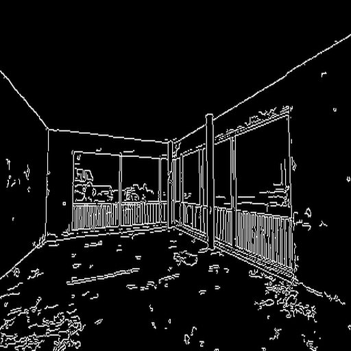
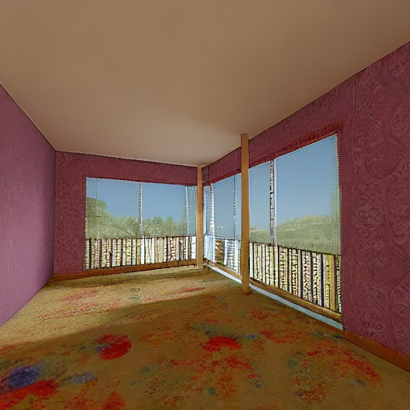

```python
import os
os.chdir('mmagic')
```


```python
import cv2
import numpy as np
import mmcv
from mmengine import Config
from PIL import Image

from mmagic.registry import MODELS
from mmagic.utils import register_all_modules

register_all_modules()

cfg = Config.fromfile('configs/controlnet/controlnet-canny.py')
controlnet = MODELS.build(cfg.model).cuda()

control_img = mmcv.imread('mp.png')
control = cv2.Canny(control_img, 50, 100)
control = control[:, :, None]
control = np.concatenate([control] * 3, axis=2)
control = Image.fromarray(control)

prompt = 'A fully furnished room with colorful wallpapers'

output_dict = controlnet.infer(prompt, control=control)
samples = output_dict['samples']
for idx, sample in enumerate(samples):
    sample.save(f'output/sample_{idx}.png')
controls = output_dict['controls']
for idx, control in enumerate(controls):
    control.save(f'output/control_{idx}.png')
```

    Cannot initialize model with low cpu memory usage because `accelerate` was not found in the environment. Defaulting to `low_cpu_mem_usage=False`. It is strongly recommended to install `accelerate` for faster and less memory-intense model loading. You can do so with: 
    ```
    pip install accelerate
    ```
    .


    06/18 18:05:45 - mmengine - INFO - Set model dtype to 'torch.float32'.


    Cannot initialize model with low cpu memory usage because `accelerate` was not found in the environment. Defaulting to `low_cpu_mem_usage=False`. It is strongly recommended to install `accelerate` for faster and less memory-intense model loading. You can do so with: 
    ```
    pip install accelerate
    ```
    .


    06/18 18:05:52 - mmengine - INFO - Creating runwayml/stable-diffusion-v1-5 by 'HuggingFace'


    Cannot initialize model with low cpu memory usage because `accelerate` was not found in the environment. Defaulting to `low_cpu_mem_usage=False`. It is strongly recommended to install `accelerate` for faster and less memory-intense model loading. You can do so with: 
    ```
    pip install accelerate
    ```
    .


    Do not support Xformers. Please install Xformers first. The program will run without Xformers.
    06/18 18:05:55 - mmengine - INFO - Set model dtype to 'torch.float32'.
    Do not support Xformers. Please install Xformers first. The program will run without Xformers.


    100%|███████████████████████████████████████████████████████████████████████████████████████████████████████████████████| 20/20 [00:03<00:00,  6.50it/s]


```python
from PIL import Image
img_path='output/control_0.png'
Image.open(img_path)
```


    

    


```python
from PIL import Image
img_path='output/sample_0.png'
Image.open(img_path)
```


    

    


```python

```


```python

```


```python

```


```python

```
